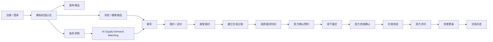
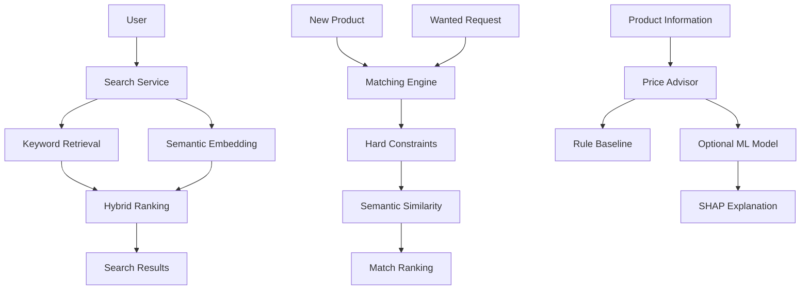
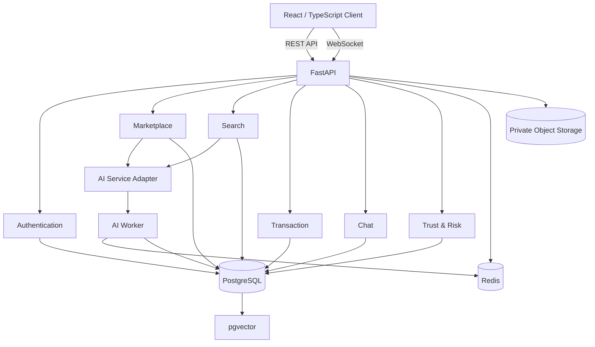

# 🎓 CampusLoop AI

<div align="center">

## AI 增强型校园可信二手交易与智能匹配平台

### An AI-Enhanced Trusted Campus Second-Hand Marketplace

**让校园二手交易从“发帖找人”，升级为“智能发现、精准匹配、可信协作”。**

<br>


</div>

---

## 📌 About CampusLoop AI

**CampusLoop AI** 是一个面向大学校园场景设计的 AI 增强型二手交易平台。

传统校园二手交易通常依赖微信群、QQ群、社交媒体或通用二手交易平台，商品信息、求购需求、联系方式和交易状态分散在不同渠道中。

CampusLoop AI 希望建立一个统一的校园二手交易空间，将：

- 商品发布
- 商品搜索
- 求购需求
- AI 智能匹配
- AI 语义搜索
- 价格建议
- 即时聊天
- 在线议价
- 面交预约
- 订单协作
- 双方交易确认
- 评价体系
- 信誉体系
- 风险检测
- 举报与人工审核
- 数据分析

整合进一个完整的软件系统。

CampusLoop AI 不只是一个“校园版闲鱼”。

项目重点在于：

> **将 AI 能力真正嵌入校园交易业务流程，而不是把 AI 做成独立的演示功能。**

---

# 💡 Why CampusLoop?

校园二手交易有几个非常典型的问题。

### 🔍 信息碎片化

商品和求购信息散落在微信群、QQ群、朋友圈等渠道，很难统一搜索和持续追踪。

### 🧠 搜索方式过于简单

买家往往描述的是：

> “想买一台便宜点的电脑，用来写 Python 和上课。”

而卖家发布的可能是：

> “ThinkBook 14+ R7 7840H 16G 512G”

传统关键词搜索很容易错过这种匹配。

### 💰 二手商品定价困难

不同：

- 品牌
- 型号
- 成色
- 使用时间
- 原价
- 市场需求

都会影响商品价格。

学生往往缺少统一参考。

### ⏳ 供需存在时间错位

今天有人：

> “求购一台二手显示器。”

但今天市场里可能没有。

两天后有人发布显示器时，原来的买家通常不会收到提醒。

### 🤝 面交协商成本高

校园交易经常出现：

> “你什么时候有空？”

> “晚上呢？”

> “晚上我要上课。”

> “那明天下午？”

大量时间浪费在时间和地点协调上。

### 🛡️ 缺少可信交易机制

普通群聊很难持续记录：

- 爽约
- 举报
- 交易评价
- 商品状态
- 历史交易
- 风险行为

CampusLoop AI 希望为这些问题建立一个完整的软件解决方案。

---

# ✨ Core Features

## 🛒 Campus Marketplace

完整校园二手市场，包括：

- 商品发布
- 多图片上传
- 分类管理
- 商品成色
- 品牌信息
- 商品描述
- 原价与售价
- 校园地点
- 最新商品
- 热门商品
- 分类浏览
- 高级筛选
- 收藏
- 商品上下架
- 商品生命周期管理

---

## 🔎 Hybrid Search

平台计划同时支持：

### Keyword Search

传统关键词搜索。

例如：

```text
iPad
自行车
高数教材
显示器
AirPods
```

### AI Semantic Search

允许用户直接使用自然语言表达需求。

例如：

```text
想买一台 3000 左右能写代码的轻薄电脑
```

或者：

```text
想找一本适合大一微积分的教材
```

系统计划结合：

```text
Keyword Retrieval
        +
Semantic Embedding Retrieval
        +
Structured Filters
        ↓
Hybrid Ranking
```

在 AI 服务不可用时，系统仍然能够自动降级到普通关键词搜索。

---

# 🤖 Wanted Marketplace + AI Matching

这是 CampusLoop AI 的核心特色之一。

用户不仅可以：

> 发布商品

还可以：

> 发布“我想买什么”。

例如：

```text
求购：
二手显示器

预算：
¥400 - ¥700

要求：
24 英寸以上

地点：
校内交易

成色：
良好及以上
```

系统保存需求。

以后出现新的符合条件商品时，自动触发匹配。

```text
New Product
      ↓
Hard Constraints
      ↓
Semantic Matching
      ↓
Ranking
      ↓
Top Matches
      ↓
Notification
```

匹配结果不仅展示分数，还计划解释：

```text
92% Match

✓ Category matched
✓ Budget matched
✓ Condition matched
✓ Campus location matched
✓ Semantic description highly relevant
```

这样用户不用每天重复搜索。

---

# 💰 AI Fair Price Advisor

卖家发布商品时，可以获得价格参考。

例如：

```text
MacBook Air M2
8GB + 256GB
Condition: Good
Purchase Age: 2 Years
Original Price: ¥7999
```

系统可能给出：

```text
Estimated Fair Price

¥4,150

Suggested Range

¥3,850 - ¥4,450
```

同时解释主要影响因素。

```text
↓ Device age
↓ Visible wear
↑ Brand resale value
↑ Current category demand
```

平台只提供 **价格建议**。

最终商品价格始终由卖家决定。

---

# 🗓️ Smart Meetup Scheduler

CampusLoop AI 主要面向：

> **校园线下面交**

因此系统计划提供智能预约功能。

买卖双方分别提交自己的空闲时间。

例如：

```text
Buyer

Monday
14:00 - 17:00

Tuesday
10:00 - 12:00


Seller

Monday
16:00 - 18:00

Tuesday
08:00 - 11:00
```

系统自动计算共同时间。

```text
Recommended

① Monday 16:00 - 17:00
② Tuesday 10:00 - 11:00
```

再结合校园公共地点偏好给出面交方案。

---

# 💬 Realtime Chat & Bargaining

平台计划提供完整的实时交易沟通系统。

包括：

- WebSocket 实时聊天
- 历史消息
- 商品上下文
- 求购上下文
- 报价
- 还价
- 接受报价
- 拒绝报价
- Offer 有效期
- 系统消息
- 订单状态消息
- 网络重连
- 消息去重

议价不是简单发送一句：

```text
300 行不行？
```

而是结构化 Offer。

```text
Offer

Original Price
¥500

Buyer Offer
¥420

Status
Pending
```

---

# 🔄 Transaction Workflow

完整交易流程预计为：



系统本身不处理实际付款。

付款及商品核验由交易双方线下完成。

---

# 🛡️ Trust & Risk System

CampusLoop AI 不把“校园”理解成：

> 天然安全。

项目计划建立可解释的 Trust & Risk 机制。

可能参考的信息包括：

```text
Completed Transactions
Review History
Cancellation History
No-show Behaviour
Reports
Account Activity
Transaction Events
```

形成：

### Trust Indicators

用于帮助用户理解历史行为。

### Risk Indicators

用于给管理员提供审核线索。

需要特别说明：

> **Risk Score 不等于欺诈判定。**

风险系统不会因为一个模型输出就自动封禁用户。

重要处理仍然保留人工审核。

---

# 🚨 Reporting & Moderation

平台计划支持：

```text
User Report
Product Report
Transaction Report
Chat Evidence
Risk Signals
Admin Review
Decision
Audit Log
```

管理员可以处理：

- 举报
- 风险事件
- 商品内容
- 用户状态
- 交易纠纷

敏感操作需要被记录。

---

# ⭐ Review System

完成交易后，买卖双方可以评价。

评价信息将参与：

```text
Public Rating
Transaction History
Trust Explanation
```

失败、取消或者发生争议的交易不会被直接视为：

```text
Completed Transaction
```

避免人为制造虚假交易历史。

---

# 📊 Analytics

管理端计划提供基础数据分析能力。

例如：

```text
Registered Users
Active Listings
Completed Transactions
Marketplace Trends
Category Popularity
Average Listing Price
Matching Statistics
AI Exposure / Acceptance
Report Statistics
Risk Review Statistics
```

统计数据需要明确：

- 时间范围
- 数据口径
- 分母
- 数据来源

避免使用具有误导性的指标。

---

# 🧠 AI Architecture

CampusLoop AI 不计划把整个项目“交给一个大模型”。

不同 AI 功能使用适合自己的技术。



计划使用的 AI / ML 技术包括：

```text
Sentence Transformers
Vector Embeddings
Cosine Similarity
Hybrid Retrieval
pgvector
Rule-based Matching
LightGBM
SHAP
Isolation Forest (Stretch Goal)
```

复杂模型只有在数据量、许可和实验效果满足要求后才会启用。

---

# 🏗️ System Architecture

CampusLoop AI 计划采用：

> **Modular Monolith + AI Worker**

而不是过早拆成大量微服务。



这样既保留清晰的模块边界，又避免学生项目因为过度微服务化产生不必要的：

```text
Distributed Transactions
Network Complexity
Service Discovery
Deployment Complexity
Observability Overhead
```

---

# 🧰 Technology Stack

| Layer | Planned Technology |
|---|---|
| Frontend | React |
| Language | TypeScript |
| Backend | FastAPI |
| Backend Language | Python |
| Database | PostgreSQL |
| Vector Search | pgvector |
| ORM | SQLAlchemy |
| Realtime | WebSocket |
| Cache | Redis |
| Async Tasks | Celery / Worker |
| Object Storage | MinIO |
| AI Embedding | Sentence Transformers |
| ML | LightGBM |
| Explainability | SHAP |
| Anomaly Experiment | Isolation Forest |
| Testing | Pytest / Frontend Testing / E2E |
| Deployment | Docker / Docker Compose |
| CI | GitHub Actions |

---

# 📦 Delivery Scope

CampusLoop AI 将按照三个层级控制开发范围。

### MVP

首先完成完整交易闭环：

```text
Account
Profile
Product Listing
Marketplace
Keyword Search
Favorite
Chat
Offer
Transaction
Manual Meetup
Two-sided Confirmation
Review
Reporting
Notification
Minimum Admin
```

### Core

在 MVP 稳定以后加入：

```text
Wanted Marketplace
AI Supply-Demand Matching
AI Semantic Search
Fair Price Advisor
Smart Meetup Recommendation
Trust Engine
Risk Rules
Analytics
Audit
```

### Stretch

时间允许后再开发：

```text
Isolation Forest Risk Experiment
AI Listing Assistant
Advanced Recommendation
Advanced Analytics
Additional Notification Channels
```

---

# 🔐 Privacy & Security

CampusLoop AI 遵循：

> **Minimum Necessary Data Collection**

原则。

公开用户资料计划只展示必要的信息。

例如：

```text
Nickname
Avatar
Campus Verification Indicator
Transaction Count
Aggregated Rating
Trust Explanation
Bio
```

以下数据不会公开：

```text
Email
Refresh Token
Private Availability Schedule
Private Chat Messages
Report Evidence
```

管理员访问聊天证据需要与举报或纠纷关联，并记录审计信息。

---

# 🚫 Project Boundaries

为了保证软件工程课程项目可以真正完成，以下功能明确不属于当前范围：

```text
Real Alipay / WeChat Pay
Bank Card Payment
Financial Settlement
Real Logistics
Delivery Tracking
Real University SSO
Real Student Identity Verification
Government ID Verification
Blockchain
IoT Hardware
RFID
NFC
Raspberry Pi
Arduino
Smart Locker
Cross-campus Trading
Commercial Fraud Guarantee
```

订单表示：

> **交易协作记录**

而不是金融支付订单。

---

# 🧪 Testing Strategy

CampusLoop AI 不以：

> “页面能打开”

作为项目完成标准。

项目计划建立多层测试：

```text
Unit Tests
Service Tests
API Tests
Database Tests
Permission Tests
State Machine Tests
WebSocket Tests
AI Evaluation
Integration Tests
End-to-End Tests
Performance Tests
Security Tests
Recovery Tests
```

AI 模块也必须有独立评估。

例如语义搜索：

```text
Precision@K
Recall@K
MRR
```

价格建议：

```text
MAE
MAPE
Prediction Interval Coverage
```

并与基础算法进行比较。

---

# ⚡ Performance Goals

项目计划在统一测试环境中验证：

```text
API Performance
Search Performance
WebSocket Delivery
AI Task Latency
Concurrent Users
Database Queries
```

性能目标属于未来验收指标。

README 中不会把尚未执行的性能测试描述成已经达到的结果。

---

# 📅 Development Roadmap

```text
Week 1
Requirements Validation
↓
Week 2
Architecture & API Contracts
↓
Week 3
Foundation + Authentication
↓
Week 4
Marketplace
↓
Week 5
Chat + Transaction
↓
Week 6
Wanted Marketplace + Matching
↓
Week 7
Semantic Search + Price AI
↓
Week 8
Admin + Trust + Risk
↓
Week 9
Testing + Performance + Fixes
↓
Week 10
Documentation + Demo + Final Integration
```

---

# 👥 Team

CampusLoop AI 是大学软件工程课程的团队项目。

```text
Team Size
10

Development Cycle
10 Weeks

Estimated Total Workload
~800 Person Hours
```

团队开发将采用：

```text
Git
GitHub
Issues
Branches
Pull Requests
Code Review
CI
Milestones
Documentation
```

进行协作。

---

# 📁 Repository Structure

预计项目最终形成类似结构：

```text
CampusLoop-AI/
│
├── frontend/
│
├── backend/
│
├── worker/
│
├── tests/
│
├── docs/
│
├── scripts/
│
├── docker/
│
├── .github/
│   └── workflows/
│
├── docker-compose.yml
├── .env.example
├── README.md
└── LICENSE
```

具体目录结构将在 Architecture / Foundation 阶段冻结。

---

# 📚 Documentation

详细的软件需求、总体设计、AI 方案、数据库设计、测试策略、项目管理与风险分析见：

四组五阶段的任务、交接、验收与关闭标准统一见 [分阶段 Issue 索引](docs/issues/README.md)；前端成员交付物见 [前端文档索引](docs/frontend/README.md)。

```text
CampusLoop AI
Software Requirements,
Project Proposal
and Preliminary System Design
```

设计文档涵盖：

```text
Project Requirements
Use Cases
Innovation Analysis
Technology Stack
System Architecture
Frontend Design
Backend Design
API Design
Database Design
AI Design
Security & Privacy
Testing
Team Responsibilities
Project Management
Risk Register
Requirements Traceability
```

---

# 🚧 Current Development Status

> **Status: Requirements & Design Only**

当前项目处于：

```text
Planning
Requirements Engineering
Architecture Design
AI Design
Database Design
Testing Design
Project Management
```

阶段。

目前 README 中描述的功能：

> **均为计划实现功能，而不是已经完成的软件功能。**

因此当前仓库不会使用以下描述：

```text
Completed
Production Ready
AI Accuracy: XX%
100% Secure
Successfully Supports XXX Users
```

除非未来已经有真实实验或测试结果支持。

---

# 🎯 Project Goal

CampusLoop AI 的目标不是堆砌尽可能多的 AI 模型。

而是尝试回答一个更加实际的软件工程问题：

> **AI 如何真正参与一个完整校园交易系统，而不是成为与业务分离的 Demo？**

我们希望最终完成一个具有：

```text
完整交易闭环
+
真实软件工程架构
+
可测试 AI 模块
+
智能供需匹配
+
实时通信
+
可信交易机制
+
风险治理
+
自动化测试
+
规范项目管理
```

的校园二手交易平台。

---

# ⚠️ Disclaimer

CampusLoop AI 为大学软件工程课程项目。

校园认证属于教学模拟，不代表真实学校身份或学籍认证。

平台不提供：

- 支付担保
- 金融结算
- 商品质量保证
- 真实身份核验
- 商业级反欺诈保证

AI 输出仅作为搜索、匹配、价格参考及风险审核辅助信息。

最终交易决定由用户自行完成。

---

<div align="center">

# CampusLoop AI

### Search Smarter · Match Better · Trade with Confidence

**AI-Enhanced Campus Marketplace**

🚧 Currently in Requirements & Design Stage

</div>
