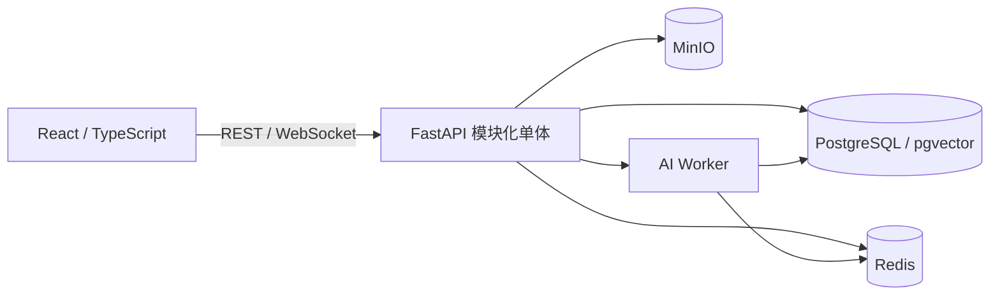

# CampusLoop AI

CampusLoop AI 是一个面向大学生的校园二手交易与智能匹配课程项目。项目计划把商品发布、搜索、聊天、议价、订单、见面约定、双方完成确认、评价和人工治理组织为可追踪的交易闭环，并在基础能力稳定后加入可解释、可评估、可降级的语义搜索、供需匹配和价格建议。

> 当前状态：第一阶段需求验证与前端原型并行。仓库已有基于 Mock 数据的登录、资料、管理和交易流程前端代码，但尚未证明真实后端、数据库、AI 服务、容器环境或完整端到端联调已经完成。

## 当前仓库状态

| 领域 | 当前状态 | 证据/说明 |
|---|---|---|
| 项目需求与分工 | 候选文档已形成 | [项目说明 Markdown](docs/project-overview.md)、[Phase 1 Issues](docs/issues/phase-1-group-issues.md) |
| 项目管理与质量 | 第一阶段候选文档已形成 | [管理与质量文档索引](docs/management/README.md) |
| 前端工程 | 已有 React/TypeScript 原型；构建通过，Lint 待修复 | `frontend/`；包含 Mock 登录、资料、后台和交易流程页面 |
| 真实前后端联调 | 未完成/未验证 | 当前仓库没有正式后端服务目录 |
| PostgreSQL/Redis/MinIO | 计划采用，未落地 | 等待后端与平台组确认运行方案 |
| 语义搜索/匹配/价格建议 | 候选范围，未实现 | 必须先有数据许可、规则/关键词基线和评估方案 |
| Docker/CI/恢复演练 | 计划采用，未落地 | 不把计划架构描述为当前能力 |

功能状态以实际代码、测试结果和合并记录为准。README、截图或口头说明不能替代验收证据。

## 项目目标

CampusLoop AI 主要解决以下校园场景问题：

- 商品和求购信息分散、容易过期且难以持续追踪。
- 用途型自然语言与商品标题不一致，关键词搜索容易漏检。
- 求购与商品在不同时间出现，供需双方需要重复搜索。
- 买卖双方缺少可解释的价格参照。
- 线下面交需要聊天、报价、约定、双方确认和评价的连续记录。
- 校园并不天然可信，举报、异常行为和管理员决定需要审计。

平台只提供交易协作与辅助信息，不处理实际付款，不担保商品质量或真实学籍。

## 范围候选

### MVP

- 注册、登录、资料和角色权限
- 商品发布、编辑、上下架、市场列表和详情
- 关键词搜索、结构化筛选和收藏
- 双人聊天、历史补拉和结构化议价
- 唯一订单、状态事件、事务、并发和幂等约束
- 记录双方私聊后确定的见面时间与地点
- 双方独立完成确认和完成后评价
- 举报、站内通知、基础管理后台和审计

### Core

- 求购市场
- 语义搜索与关键词降级
- 求购-商品供需匹配和匹配原因
- 价格建议区间与规则基线
- 规则化信誉说明
- 基础统计与审计查询

### Stretch

- 风险智能实验，仅作为人工审核线索
- 智能商品描述助手
- 高级推荐与高级分析
- 邮件等额外通知渠道
- Isolation Forest 等异常检测实验

完整的编号、负责人、依赖、验收条件和周次见 [需求追踪表](docs/management/m1/requirements-traceability.md)。

## 关键业务规则

- 一个账号可在不同交易中作为买方或卖方，但不能购买自己的商品。
- 接受报价是后端业务动作；同一商品只能产生一个有效占用订单。
- 见面功能只记录双方协商后的时间与地点，不开发智能时间或地点推荐。
- 修改见面约定后，旧版本确认失效。
- 单方完成确认不能使订单完成；双方针对有效版本确认后才可完成。
- 只有已完成订单的参与者可以评价，且每方只能评价一次。
- 匹配分表示相关程度，不是成交概率。
- 价格建议仅供参考，卖家保留定价权。
- 风险结果只提供人工审核线索，不得自动封禁或认定欺诈。
- AI、Redis 或 WebSocket 不可用时，基础发布、浏览、关键词搜索和可替代交易流程应继续运行。

## 明确不做

- 真实支付宝、微信、银行卡支付或资金结算
- 真实物流和配送跟踪
- 真实学校 SSO、学籍认证或身份证认证
- 跨校交易
- 区块链或商业级反欺诈保证
- Arduino、RFID、NFC、摄像头、智能柜等硬件
- 大量微服务或 Kubernetes
- AI 自动定价、自动封禁或自动认定欺诈

## 候选架构

项目计划采用“模块化单体 + 智能任务进程”，避免在十周课程项目中过早拆分微服务。



| 层 | 候选技术 | 当前仓库状态 |
|---|---|---|
| 前端 | React、TypeScript、Vite、Ant Design、ECharts、Zustand、Axios | 已有原型工程 |
| 后端 | Python、FastAPI、SQLAlchemy | 未落地 |
| 数据库 | PostgreSQL、pgvector | 未落地 |
| 实时与缓存 | WebSocket、Redis | 前端有 Mock WebSocket；真实服务未落地 |
| 对象存储 | MinIO | 未落地 |
| 智能功能 | sentence-transformers、规则基线；条件满足后评估 LightGBM/SHAP | 未落地 |
| 测试 | pytest、前端测试、Playwright | 测试策略已形成；自动化入口待建 |
| 运行环境 | Docker、Docker Compose、GitHub Actions | 未落地 |

候选技术只有在对应负责人完成设计评审和可复现验证后，才视为正式采用。

## 本地运行当前前端原型

环境要求：Node.js 和 npm。当前前端主要使用 Mock 数据，不代表真实后端联调。

```bash
cd frontend
npm install
npm run dev
```

默认由 Vite 输出本地访问地址。提交前可执行：

```bash
cd frontend
npm run lint
npm run build
```

2026-09-19 的验证快照：`npm run build` 通过；`npm run lint` 仍有 3 个既有错误，位于 `src/components/Can.tsx` 和 `src/router/index.tsx`。构建还提示主 JavaScript 包较大，后续由前端组评估按路由拆包。这些问题已登记在 M10 [文档复核记录](docs/management/m10/review-log.md)，因此当前不能宣称质量检查全部通过。

## 当前目录

```text
CampusLoop/
|-- docs/
|   |-- frontend/m4/              # M4 交易流程设计材料
|   |-- issues/                   # 第一阶段四组任务说明
|   |-- management/               # M1/M10 管理与质量材料
|   `-- project-overview.md       # PDF 1.2 的 Markdown 整理版
|-- frontend/                     # React/TypeScript 前端原型
|-- .env.example
|-- CampusLoop_AI_Project_Overview_(3).pdf
`-- README.md
```

后端、Worker、数据库迁移、Docker 和 CI 等目录将在对应方案落地时加入，不在 README 中预先伪造空结构。

## 文档入口

- [项目需求与团队分工说明书（Markdown）](docs/project-overview.md)
- [项目管理与质量文档](docs/management/README.md)
- [项目范围与优先级](docs/management/m1/project-scope.md)
- [需求候选清单与追踪表](docs/management/m1/requirements-traceability.md)
- [十周计划与五次汇报](docs/management/m1/ten-week-plan.md)
- [测试策略候选版](docs/management/m10/test-strategy.md)
- [核心验收场景](docs/management/m10/acceptance-scenarios.md)
- [Issue 1：项目管理与质量组](docs/issues/issue-1-management-quality.md)
- [Issue 2：前端体验组](docs/issues/issue-2-frontend-experience.md)
- [Issue 3：后端与平台组](docs/issues/issue-3-backend-platform.md)
- [Issue 4：智能功能组](docs/issues/issue-4-ai-feasibility.md)

原始 PDF 1.2 保留作为 2026-09-15 的输入材料；后续可维护内容以 Markdown、Issue、代码和测试证据为主。

## 团队与计划

项目由 10 人在 10 周内完成，分为四个主责组：

| 小组 | 成员 | 负责范围 |
|---|---|---|
| 项目管理与质量组 | M1、M10 | 需求、计划、集成、测试、文档和发布质量 |
| 前端体验组 | M2、M3、M4 | 公共体验、市场/求购和交易流程页面 |
| 后端与平台组 | M5、M6、M9 | 账号权限、市场交易、数据库和运行环境 |
| 智能功能组 | M7、M8 | 搜索匹配、价格、信誉和风险辅助 |

五次汇报分别检查范围、详细设计、基础交易闭环、智能候选和最终提交。第 8 周停止新增功能，第 9 周集中测试与恢复演练，第 10 周只做整合、文档、演示和提交。

## 质量与证据

- 任务必须有负责人、协作者、依赖、验收条件和计划周次。
- 模块作者先自测，同组和受影响上下游评审，M10 独立复测，M1 进行业务验收。
- 数据库变更必须通过迁移脚本，接口变化同步更新页面、文档和测试。
- 准确率、性能、覆盖率和样本量只能引用真实运行结果。
- 一项任务只有代码/文档已合并、测试和关键异常路径通过、统一环境可复现时，才可标记完成。

## 免责声明

CampusLoop AI 是大学软件工程课程项目。校园认证属于教学模拟，不代表真实学校身份或学籍认证。平台不提供支付担保、金融结算、商品质量保证、真实身份核验或商业级反欺诈保证。AI 输出仅用于搜索、匹配、价格参考和风险审核辅助，最终交易及治理决定由用户或管理员完成。
