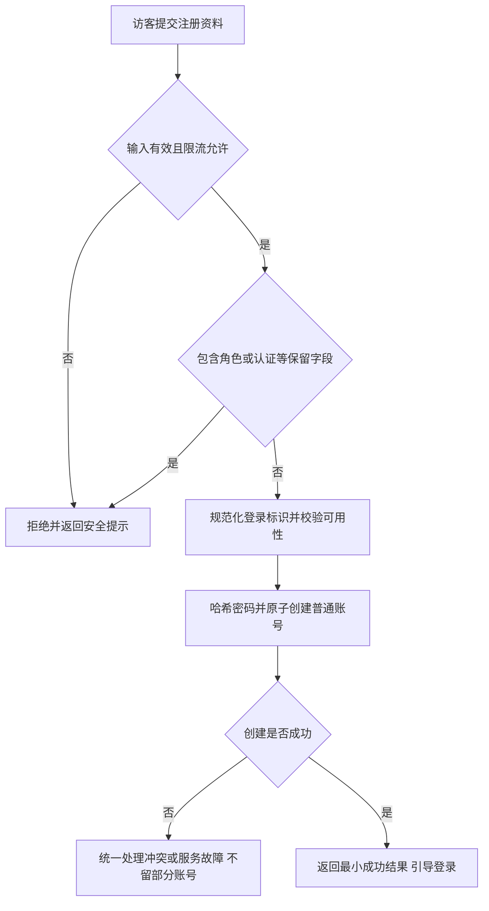
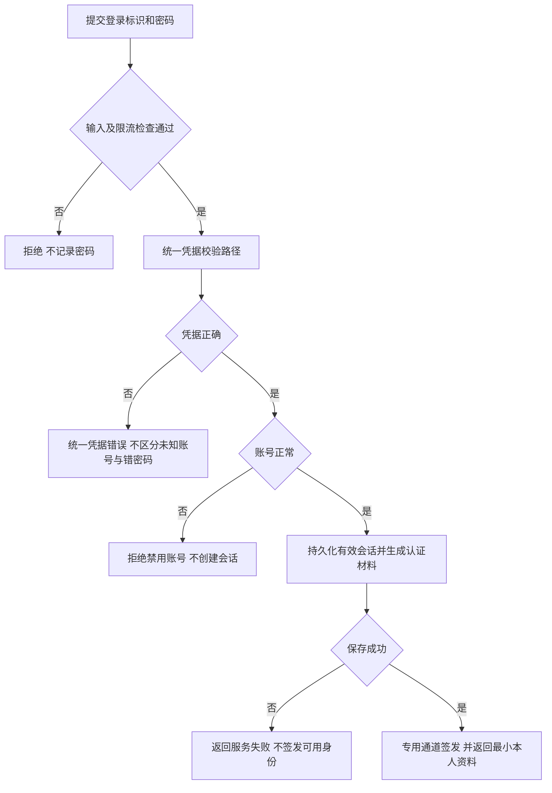
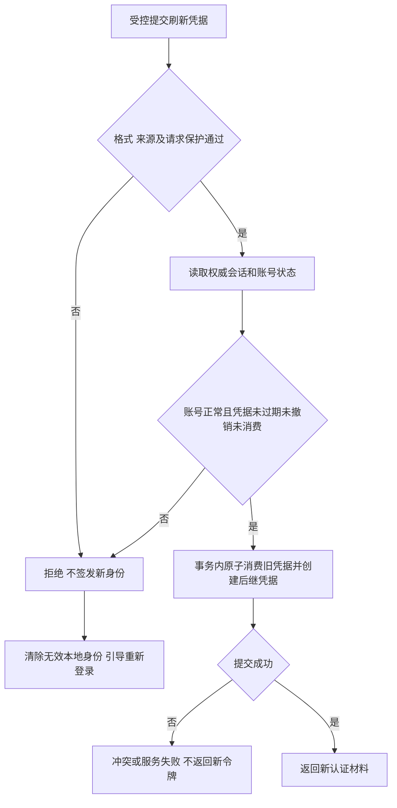
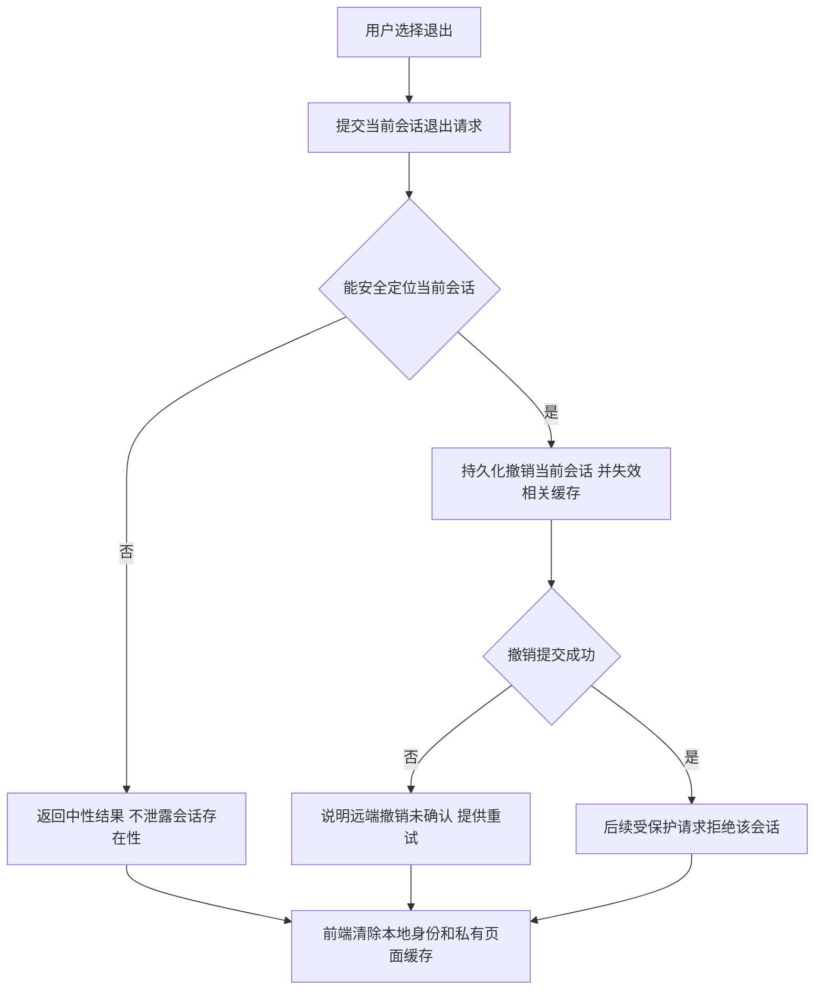
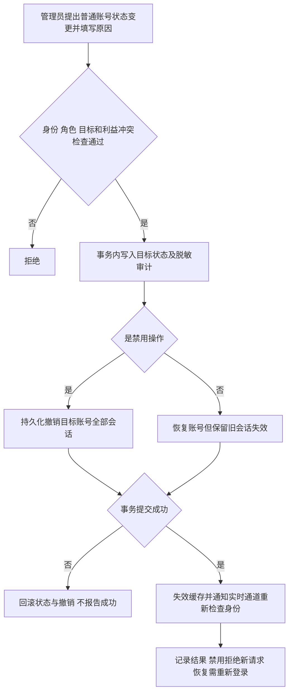
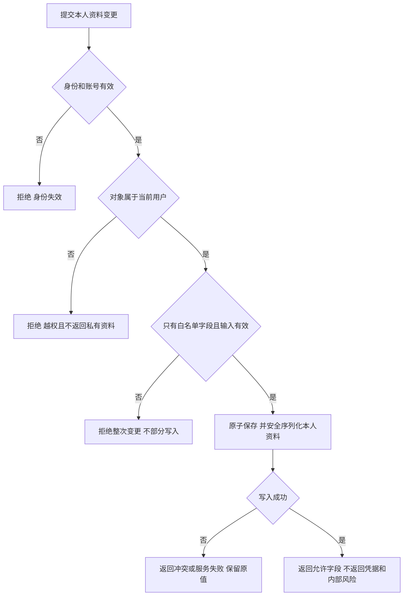

# BP1-03 认证流程、失败路径与风险

> Owner：M5（胡可铭）｜日期：2026-09-27｜状态：Phase 1 候选设计，非接口或安全测试结果
> 配套：[账号边界](auth-domain.md)、[字段可见性](user-field-visibility.md)。图中均为能力名称，不冻结路径、算法参数、令牌寿命或状态码。

## 1. 注册

候选采用注册后单独登录，避免隐式会话创建；M2/M5 在 Phase 2 确认。并发重复注册只有一个账号成功；重复标识对外提示与账号枚举风险需在契约评审中平衡，不能泄露额外身份资料。不在 Phase 1 引入真实邮箱验证或找回密码功能。

## 2. 登录

减少可观察的账号存在性差异，不能只让错误文案相同而保留明显不同的校验路径。生产身份不得接受前端 `prototype-token`、客户端 userId/role 或演示身份选择作为认证证据。

## 3. 刷新

- 并发刷新不得产生两个有效后继；客户端应合并同一会话的并发刷新请求。网络响应丢失后的重试/安全恢复语义由 Phase 2 明确。
- 已轮换旧凭据再次出现视为重放候选，拒绝并记录无敏感值事件；是否撤销同一刷新链及并发误报策略由 M5/M9/M10 在 Phase 2 冻结。不能仅靠摘要唯一约束实现轮换。
- PostgreSQL 保存会话状态与撤销事实；Redis 不可用时回源验证，回源失败则拒绝受保护操作。

## 4. 退出

重复退出可以幂等处理；不能让客户端提交任意用户标识以撤销他人会话。清理本地状态不代表服务端已撤销。当前退出不默认退出所有设备；全账号撤销用于禁用等受控操作。

## 5. 禁用与恢复

账号、撤销与审计由同一数据库事务或等效一致性方案保证。缓存失效通知失败不能导致继续授权：后续受保护请求必须从可靠状态判断；禁用前已开始的并发操作由 M5/M6 在写入提交边界复核授权。WebSocket 长连接需主动关闭或在继续收发前校验，不依赖客户端自觉退出。历史订单的取消、暂停或争议处理属于 M6 规则，禁用不擅自改变订单事实。

## 6. 修改资料

昵称、头像、简介和可选展示信息按白名单处理；邮箱变更、密码变更、角色提升不混入资料更新。并发编辑冲突策略由 Phase 2 明确。任何客户端发送的 ownerId 都不能代替当前认证主体。

## 7. 失败语义与前端恢复

| 情形 | 服务端必须保证 | 前端可做动作 | Phase 2 需冻结 |
|---|---|---|---|
| 错密码/未知账号 | 相同凭据错误语义，不创建会话 | 留在登录页，安全提示；不显示账号是否存在 | 文案、错误码与限流 |
| 访问令牌过期 | 拒绝直接访问，不能仅因 token 存在放行 | 有有效刷新途径时只发起受控刷新；失败返回登录 | 状态码、单次刷新与重试边界 |
| 刷新过期/撤销/重放 | 不签发新身份 | 清除旧身份重新登录，不无限重试 | 撤销链与并发策略 |
| 禁用账号 | 不登录、不刷新、不允许受保护动作 | 清理私有状态并显示账号不可用 | 失败优先级与用户可见说明 |
| 角色/对象越权 | 不读写目标、不回显私有字段 | 显示无权限；不能仅靠隐藏按钮 | 403/404 等具体映射 |
| 服务/数据库不可用 | 不放行、不声称写入或撤销成功 | 可重试并区分服务故障和用户输入错误 | 错误码、超时、幂等策略 |
| 审计不可写 | 敏感读取与管理变更拒绝 | 提示操作未完成 | 与业务事务的一致性方案 |

HTTP 401/403 是前端原型现有约定；M9 文档出现 423 候选，均须由 Phase 2 统一，Phase 1 不同时发布相互矛盾的固定状态码。

## 8. 攻击与风险控制清单

| 风险 | 候选控制与验证方向 | Owner |
|---|---|---|
| 撞库、暴力登录、账号枚举 | 限流与一致凭据提示；不泄露账号存在性；观测异常失败 | M5/M9，M10 验收 |
| XSS 窃取令牌、CSRF | 安全输出；在 Phase 2 比较 HttpOnly Cookie 与其他传输方案，联动 CSRF/CORS/来源校验；不能照搬 Mock localStorage | M5/M2/M9 |
| 刷新重放/并发双签发 | 原子消费、轮换关系、撤销事实；双请求推演 | M5/M9 |
| IDOR/批量赋值升权 | 身份绑定对象、字段白名单、角色与状态由服务端决定 | M5/M6 |
| 过期/禁用会话继续使用 | HTTP 与 WebSocket 共用失效语义，缓存失效不能绕过权威状态 | M5/M6/M9 |
| 管理员越界读证据 | 事项授权、最小范围、审计和利益冲突分离 | M5/M6 |
| 公开存储泄露、预签名滥用 | 公私桶隔离、授权后短时访问、明确撤销限制 | M5/M9 |
| SQL/日志/错误泄露隐私 | 参数化查询、安全序列化、脱敏错误与日志 | M5/M9 |

完整跨权限、状态、并发与环境场景见 [BP1-11 候选清单](high-risk-scenarios.md)。这里只完成设计，不宣称任何攻击测试已经通过。
