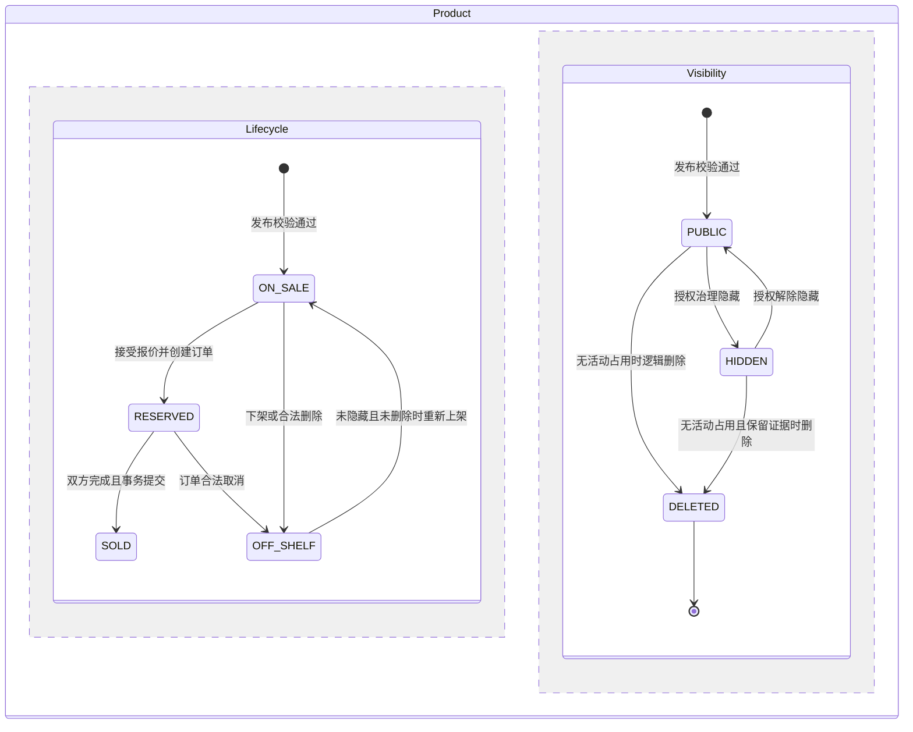
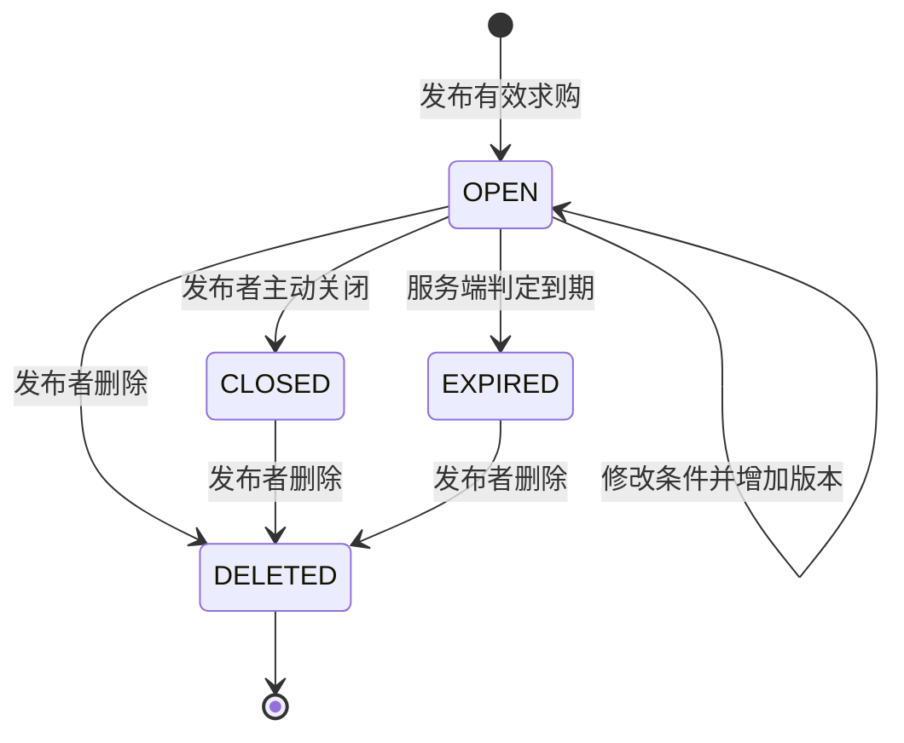
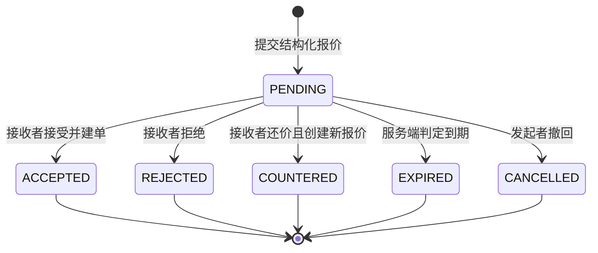
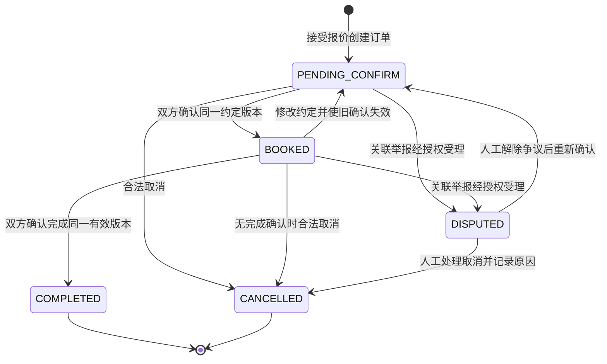
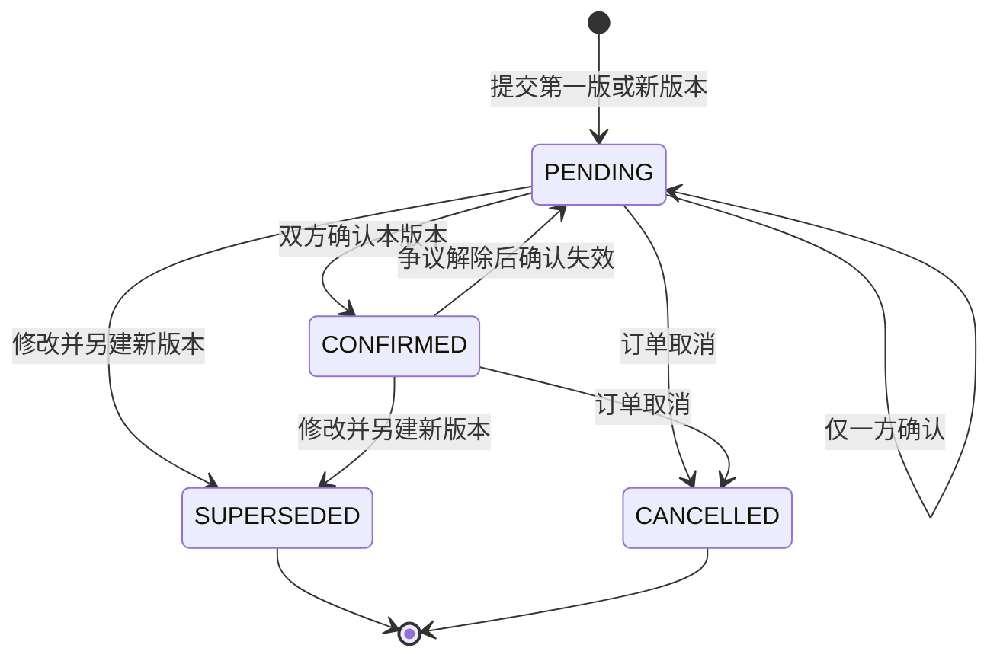

# BP1-05 五类业务状态机（M6 提交评审版）

> 主责：M6；版本：0.2；日期：2026-09-27；状态：设计候选，供 Phase 1 PR 评审，未冻结枚举或接口。
> 依据：[实体字典](domain-entity-catalog.md)、[M4 状态草案](../../../frontend/m4/01-transaction-state-machine.md)、[M9 ER 候选](er-candidate.md)。差异待确认，不直接修改前端或数据库。

## 1. 所有动作共用的判定顺序

身份与账号状态→对象访问权/参与关系→幂等重放核对→当前业务状态和版本→业务约束→事务写入状态与事件→提交后推送。

除公开读与明确授权的系统动作外，都要求有效登录。操作人从服务端认证获得；客户端不能指定另一用户代为确认，也不能直接写目标状态。无权限、旧版本、过期、状态冲突均有确定拒绝原因；HTTP 状态和错误码在 Phase 2 冻结。拒绝不产生成功业务事件。重试返回已有结果与“重新执行一次”不同，详见 [并发方案](transaction-concurrency-risks.md)。

## 2. 商品：MARKET-001～005 / TRADE-003/006

商品由两个正交维度描述：生命周期为 `ON_SALE` 在售、`RESERVED` 已占用、`SOLD` 已售、`OFF_SHELF` 已下架；展示状态为 `PUBLIC` 可按公开规则展示、`HIDDEN` 治理隐藏、`DELETED` 逻辑删除。PUBLIC 不代表必然进入在售列表，列表仍过滤生命周期。
隐藏或逻辑删除不能抹去 SOLD 事实，隐藏不能释放 RESERVED 占用。删除在售商品时同事务先转 OFF_SHELF，已售商品删除后仍保留 SOLD。这是对 M3/M9 单状态候选的拆分建议（Q05），物理字段在 Phase 2 冻结。

| 动作 / 状态变化 | 角色 | 前置 | 成功结果与事件候选 | 拒绝原因 |
|---|---|---|---|---|
| 发布：无→ON_SALE | 发布者 | 字段、图片归属/格式、校园范围合法 | 保存版本 1；商品发布事件 | 未登录、字段不合法、图片无权使用 |
| 编辑：ON_SALE/OFF_SHELF→原状态 | 发布者 | PUBLIC、未占用、预期版本为当前版 | 保存新业务版本；商品修改事件；旧报价和智能结果失效 | 非所有者、隐藏限制、已售/占用/删除、旧版本 |
| 下架：ON_SALE→OFF_SHELF | 发布者 | 当前无订单占用 | 下架事件；新报价/接受动作不可用 | 并发时已占用、非所有者 |
| 上架：OFF_SHELF→ON_SALE | 发布者 | 无未取消订单、PUBLIC、内容仍合法 | 新业务版本与重新上架事件；原有报价不复活 | 已售/删除、隐藏未解除、仍被占用 |
| 占用：ON_SALE→RESERVED | 接受报价服务 | 当前报价合法、商品未隐藏且未占用 | 同事务创建订单；商品占用事件 | 已下架/删除/隐藏、报价失效、竞争失败 |
| 售出：RESERVED→SOLD | 完成确认服务 | 关联订单满足双确认全部不变量 | 与订单完成同时提交；商品售出事件 | 非该订单占用、旧版本、单方确认 |
| 释放：RESERVED→OFF_SHELF | 取消/治理服务 | 关联订单已在同事务合法取消 | 取消与释放事件；由卖家决定是否重新上架 | 完成/争议限制、非当前占用订单 |
| 删除：PUBLIC/HIDDEN→DELETED | 发布者 | 生命周期是 ON_SALE/OFF_SHELF/SOLD，无活动交易或争议占用 | 展示置 DELETED；在售先转下架，SOLD 保持；删除事件与历史快照保留 | 已占用、无权、试图物理清除交易证据 |
| 治理隐藏/解除：生命周期不变 | M5 授权审核者 | 合法治理上下文、原因和审计；未删除 | 可见性变化事件；解除后恢复原生命周期 | 普通用户操作、缺少上下文；解除不能把 SOLD 改成 ON_SALE |

取消后默认下架是待确认建议（Q04）。隐藏期间不接受新报价；已有订单保留，是否挂起须通过明确争议动作，不能通过隐藏隐式完成或取消。编辑、下架、上架、占用、释放、售出、隐藏/解除、删除都递增商品业务版本；是否允许旧报价继续使用按第 4 节的版本规则统一判断。

非法例：生命周期 `SOLD→ON_SALE`、占用期间将展示置 DELETED、客户端直接 `ON_SALE→SOLD` 均拒绝。删除后不能恢复原记录；重新发布新资源也不修改原交易事实。

## 3. 求购：MARKET-006

候选采用 `OPEN`、`CLOSED`、`EXPIRED`、`DELETED`。`MATCHED` 不作为停止求购的事实；有匹配结果不等于已买到。草稿保存范围待 M1/M3 确认，不增加服务端 DRAFT 枚举。

| 动作 / 状态变化 | 角色 | 前置 | 成功结果与事件候选 | 拒绝原因 |
|---|---|---|---|---|
| 发布：无→OPEN | 发布者 | 预算非负且下限≤上限；截止时间在未来；必填条件合法 | 求购发布事件 | 非法预算、无效日期/地点、未登录 |
| 编辑：OPEN→OPEN | 发布者 | 未到期、版本匹配 | 新业务版本；求购修改事件；旧匹配不再有效 | 非本人、已关闭/过期/删除、旧版本 |
| 关闭：OPEN→CLOSED | 发布者 | 当前未过期且为本人资源 | 求购关闭事件；停止新匹配通知 | 非本人、状态已变；已过期不改写为关闭 |
| 过期：OPEN→EXPIRED | 系统 | 服务端时间≥截止时间 | 求购过期事件 | 尚未到期；后台延迟不能延长有效期 |
| 删除：OPEN/CLOSED/EXPIRED→DELETED | 发布者 | 对象属于本人 | 求购删除事件；保留关联消息与举报所需快照 | 非本人、试图级联清除证据 |

已关闭/已过期只能只读或删除，不能原地重新激活；可重新发布新求购（Q05）。新增联系、报价与匹配前再次判断有效性；既有会话历史仍由参与者可读，不删除订单事实。非法例：AI 命中触发 `OPEN→CLOSED`、过期后修改预算、第三方关闭求购。

## 4. 报价：TRADE-002/003/009

沿用 M4 的六类状态。发起者与接收者随还价改变；买方可以接受卖方还价，卖方可以接受买方报价，均禁止接受自己的报价（Q02）。默认 48 小时仅是 M4 候选，未冻结。

报价必须绑定明确商品、商品业务版本及当时条款快照。M6 建议任何商品业务版本变化都使旧 PENDING 报价不再可接受；过期前可撤回，重新议价必须生成新报价。接受时在锁内先比较报价所指版本与当前商品版本，相等才允许占用并递增商品版本；已经 ACCEPTED 的报价和成交快照不受后续版本递增影响。该建议避免改价、下架再上架、取消后重新出售时旧报价自动复活，待 Q02/Q05 对签。

| 动作 / 状态变化 | 角色 | 前置 | 成功结果与事件候选 | 拒绝原因 |
|---|---|---|---|---|
| 创建：无→PENDING | 会话参与者 | 商品在售可见、双方不同、金额合法、真实商品关联 | 报价创建事件；明确发起者和接收者 | 自购、会话越权、下架/占用、金额非法 |
| 接受：PENDING→ACCEPTED | 当前接收者 | 未到期、商品在售且 PUBLIC、身份合法、报价绑定商品版本仍当前 | 同事务占用商品并创建唯一订单；报价接受与订单创建事件 | 自己接受、非参与者、过期、商品版本变化、状态变更、另一订单占用 |
| 拒绝：PENDING→REJECTED | 当前接收者 | 未到期、版本有效 | 报价拒绝事件 | 非接收者、到期、非待处理状态 |
| 还价：PENDING→COUNTERED | 当前接收者 | 未到期、商品仍可交易、新金额合法 | 同事务旧报价终结、新报价 PENDING，角色对调并关联前序；还价事件 | 新报价失败时整笔回滚；其他拒绝同接受 |
| 撤回：PENDING→CANCELLED | 当前发起者 | 未到期、仍待处理 | 报价撤回事件 | 非发起者、已接受/被还价/到期 |
| 过期：PENDING→EXPIRED | 系统 | 事务内以服务端时间判断到期 | 报价过期事件；后续动作拒绝 | 未到期不得提前过期 |

过期可由访问校验与后台清理共同驱动；后台未执行时也必须拒绝到期报价。已经接受的报价不会随后“到期并取消订单”。商品被另一订单占用时，其余待处理报价不再可接受；具体显示失效还是保留拒绝原因由 M4 评审，禁止恢复终态报价。

## 5. 订单：TRADE-003～008

核心状态沿用 `PENDING_CONFIRM`、`BOOKED`、`COMPLETED`、`CANCELLED`、`DISPUTED`。现有 `MEETUP_ARRANGED` 的唯一业务含义未确定：建议作为 BOOKED 的临近见面展示，不增加权利；若保留服务端状态，需 M4/M6/M10 确定触发时间、事件和时区（Q01）。下图先表达不单设该状态的候选方案。无正式决定前不删除既有前端枚举。

除约定内容版本 v 外，引入概念“确认轮次 r”：初始为 1，改约定或解除争议均产生新轮次。所有新确认携带 v、r，双方在同一 v、r 下确认才有效。轮次增长由服务端与状态变更同事务处理，旧轮次记录保留；具体存储形式尚不冻结。解除争议即使不改时间地点，也不能重用旧轮次确认或旧幂等键。

图中不直接引入 `MEETUP_ARRANGED` 迁移；保留该候选时，适用下表与 BOOKED 相同的修改、完成、取消、争议约束。

| 动作 / 状态变化 | 角色 | 前置 | 成功结果与事件候选 | 拒绝原因 |
|---|---|---|---|---|
| 建单：无→PENDING_CONFIRM | 报价接受服务 | 同报价/商品事务全部合法 | 保存成交快照；订单创建事件 | 任一校验失败则无订单、无占用 |
| 确认约定：PENDING_CONFIRM→原状态/BOOKED | 当前买方或卖方 | 当前版本存在、版本和轮次匹配、时间地点满足第 6 节规则 | 单方只记本人确认；第二方确认后预约事件 | 旧版本/轮次、无约定、非参与者、争议/终态、未满足历史重确认条件 |
| 修改约定：PENDING_CONFIRM/BOOKED/候选 MEETUP_ARRANGED→PENDING_CONFIRM | 当前买方或卖方 | 旧版本仍当前，尚无任一完成确认 | 新约定版本；双方约定/完成确认失效；约定修改事件 | 完成确认已开始、旧版本、争议/终态 |
| 确认完成：BOOKED/候选 MEETUP_ARRANGED→原状态/COMPLETED | 当前买方或卖方 | 双方已确认当前约定，用户声明线下面交已完成 | 单方仅追加本人完成事件；第二方触发订单完成+商品已售 | 无有效预约、非参与者、争议/取消、旧版本；时间流逝不代替确认 |
| 取消：PENDING_CONFIRM/BOOKED/候选 MEETUP_ARRANGED→CANCELLED | 任一交易参与者 | 无任一完成确认；提供原因；版本匹配 | 同事务取消并释放商品到下架；取消事件 | 已完成、争议中、已有人确认完成、旧版本 |
| 受理交易争议：活动状态→DISPUTED | M5 授权审核者 | 举报指向该订单、审核上下文合法、有原因 | 争议开启事件；冻结完成、评价、改约定和普通取消，保留商品占用 | 仅提交举报无权直接迁移；终态不重写 |
| 解除争议：DISPUTED→PENDING_CONFIRM | M5 授权审核者 | 人工结论/原因/审计齐全，明确恢复协作的约定版本 | 新轮次 r+1；争议解除及旧确认失效事件；双方重新确认 | 管理员代替双方完成、缺少证据授权或原因、重新启用旧确认 |
| 争议取消：DISPUTED→CANCELLED | M5 授权审核者 | 人工决定允许取消并保存处理依据 | 取消、释放、治理审计同一事务 | 普通用户/模型自动处理、缺少原因 |

非法例：客户端直接置 COMPLETED；单方确认即完成；`DISPUTED→COMPLETED` 由管理员强制成交；`CANCELLED→BOOKED`；报价过期取消已创建订单。

本候选不设“预约超时自动取消”：没有双方确认或另一方一直未确认时，订单保持当前状态，用户按合法取消/举报路径处理。提醒不改订单事实。若团队需要自动超时释放，须另行定义期限、完成确认保护、通知与并发规则后由 Q04 评审。

已完成/已取消订单可继续举报，但不直接重写终态或伪造成新交易。若团队需要完成后的纠纷状态，须 M1/M5/M6/M10 另行定义其对历史和评价的影响（Q03），不能由本初稿擅自扩大。

## 6. 约定版本：TRADE-005/006

每份版本候选有 `PENDING`、`CONFIRMED`、`SUPERSEDED`、`CANCELLED`；无约定是“尚无记录”，不是占位版本。它们是概念状态，最终枚举或由确认记录推导待 Phase 2 决定。

| 动作 / 状态变化 | 角色 | 前置 | 成功结果与事件候选 | 拒绝原因 |
|---|---|---|---|---|
| 新建第一版：无→PENDING | 订单任一参与者 | 订单待确认；时间地点合法且未来 | 保存 v1，双方未确认；约定创建事件 | 非参与者、已存在当前版、过去时间 |
| 确认：PENDING→PENDING/CONFIRMED | 订单任一参与者 | 提交的版本与轮次均当前；订单可确认；满足下文时间规则 | 按用户、版本、轮次记确认；第二方使订单 BOOKED | 旧版本/轮次、跨用户代确认、争议/终态 |
| 修改：PENDING/CONFIRMED→SUPERSEDED，同时新建 PENDING | 订单任一参与者 | 尚无完成确认；预期旧版和当前版一致 | 旧版本只读；新版本 v+1；旧确认不迁移；订单待确认 | 并发版本变化、完成确认已开始、争议/终态 |
| 争议解除：CONFIRMED→PENDING（若原为 PENDING 则保持） | 授权治理服务 | 同订单解除争议事务；无约定时只增加订单确认轮次 | r+1；以失效事件撤销旧确认有效性，保留原约定内容和历史确认 | 直接篡改/删除历史确认、重用旧轮次、越权 |
| 取消：当前 PENDING/CONFIRMED→CANCELLED | 订单取消服务 | 对应订单合法取消 | 约定失效事件；保留历史 | 单独取消约定却不处理订单 |

完成确认与“确认约定”是两类独立动作；前者不会自动写后者。订单完成后有效约定保持只读，确认历史保留。普通预约的创建、修改和首次确认要求时间区间有效且开始时间仍在未来；候选时间解释使用校园时区 Asia/Shanghai，服务器统一比较时间点，不依赖浏览器时钟。

为避免“面交后发生争议却必须伪造未来约定才能恢复”的死路，M6 提出受限恢复规则（Q03）：仅针对解除争议事件明确引用的原约定内容，在新轮次中允许双方对已过去的时间重新确认；保留恢复原因，展示“核对原约定”而不是“预约未来见面”。这不允许普通用户新建过去约定，也不代替任何一方的完成确认。未来确需重新见面时，应修改为未来时间并产生新内容版本。无约定的订单仍须正常创建未来约定。已预约后的完成确认可在约定时间之后进行。

## 7. 评审门禁

- [ ] M3/M4 对照每个动作确认角色、前置、结果、事件和拒绝原因。
- [ ] M5/M6/M10 对 Q03/Q04 的争议、完成、取消保护达成一致。
- [ ] M9 确认状态与占用约束可表达，未把可见性与生命周期混同。
- [ ] 所有拟删除/新增枚举经 Phase 2 联合冻结后才更新前端常量、OpenAPI 和模型。
