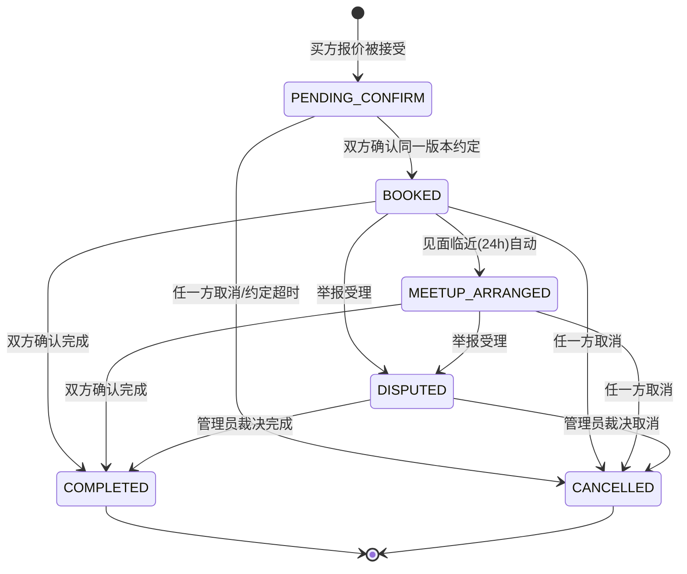

# M4-01 订单状态机与操作矩阵（第一阶段核对稿 v0.1）

> 负责人：M4 ｜ 核对方：M6（交易后端）｜ 复核：M10（并发测试场景）
> 状态：**草案**，未经 M6 确认前不作为开发依据。

## 1. 订单状态集合

| 状态 | 中文 | 说明 |
|---|---|---|
| `PENDING_CONFIRM` | 待确认 | 报价被接受后创建，等待双方确认见面约定 |
| `BOOKED` | 已预约 | 双方确认同一版本见面约定 |
| `MEETUP_ARRANGED` | 见面已安排 | 见面临近（如 24h 内），或双方均确认后进入 |
| `COMPLETED` | 已完成 | **双方独立确认完成**后才进入；商品转"已售" |
| `CANCELLED` | 已取消 | 任一方取消 / 报价过期未确认 / 约定被修改后超时未重新确认 |
| `DISPUTED` | 有争议 | 任一方举报订单且管理员受理 |

## 2. 状态迁移图

关键规则（对应 PDF 第 5 节）：
1. **单方确认不生效**：完成确认必须双方针对同一 `meetup.version` 各自确认。
2. **约定修改即失效**：`meetup.version` +1 后，双方旧确认作废，订单回到 `PENDING_CONFIRM`。
3. **评价仅限完成单**：只有 `COMPLETED` 的参与者可评价，每单每方至多一条。
4. **前端禁止改状态**：只能调用动作接口（`POST /orders/{id}/confirm-complete` 等）。

## 3. 操作矩阵（按钮可见性）

图例：✅ 可用 ｜ 🔒 可见但禁用（tooltip 说明）｜ ➖ 不展示

| 订单状态 | 角色 | 查看约定 | 确认约定 | 确认完成 | 取消订单 | 评价对方 | 举报 |
|---|---|---|---|---|---|---|---|
| 待确认 | 买/卖 | ✅ | ✅ | ➖ | ✅ | ➖ | ✅ |
| 已预约 | 买/卖 | ✅ | ➖ | ✅ | ✅ | ➖ | ✅ |
| 见面已安排 | 买/卖 | ✅ | ➖ | ✅ | ✅ | ➖ | ✅ |
| 已完成 | 买/卖 | ✅(只读) | ➖ | ➖ | ➖ | ✅(未评时) | ✅ |
| 已取消 | 买/卖 | ➖ | ➖ | ➖ | ➖ | ➖ | ✅ |
| 有争议 | 买/卖 | ✅(只读) | ➖ | ➖ | 🔒(等待管理员) | ➖ | ✅ |

代码化定义见 `src/constants/order.ts` 的 `ORDER_ACTION_MATRIX`，**文档与代码一起改**。

## 4. 报价（Offer）状态

`PENDING → ACCEPTED / REJECTED / COUNTERED / EXPIRED / CANCELLED`

- 有效期默认 48h（`OFFER_EXPIRE_HOURS`），到期由后端置 `EXPIRED`。
- 还价生成新 Offer 并将旧 Offer 置 `COUNTERED`，形成还价链。
- 仅有 `PENDING` 状态的 Offer 可被接受 / 拒绝 / 还价 / 撤回。
- 接受 Offer 是后端动作：创建订单 + 锁定商品，**并发时第二买方接受必须失败**（M10 测试点）。

## 5. 待 M6 确认的问题清单

- [ ] `MEETUP_ARRANGED` 的触发条件：见面前 24h 自动迁移，还是双方确认即迁移？
- [ ] 报价有效期 48h 是否合适？过期由定时任务还是惰性计算？
- [ ] 取消订单是否需要理由？理由是否计入信誉/风险信号（M8 关心）？
- [ ] `DISPUTED` 状态下前端取消按钮置灰的文案。
- [ ] 动作接口的幂等键：前端用 `Idempotency-Key` header 还是后端基于状态机天然幂等？
