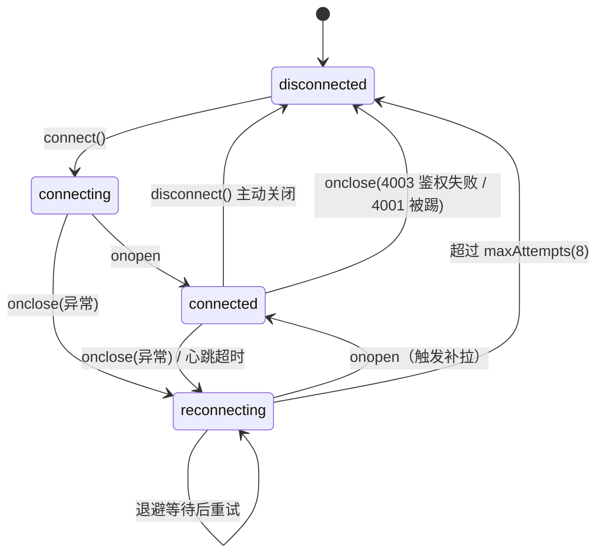
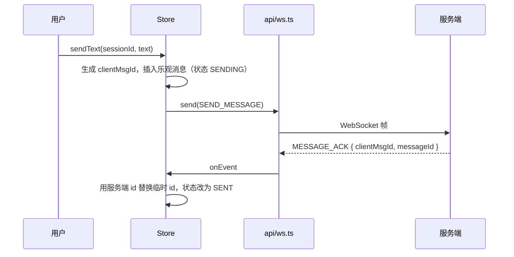
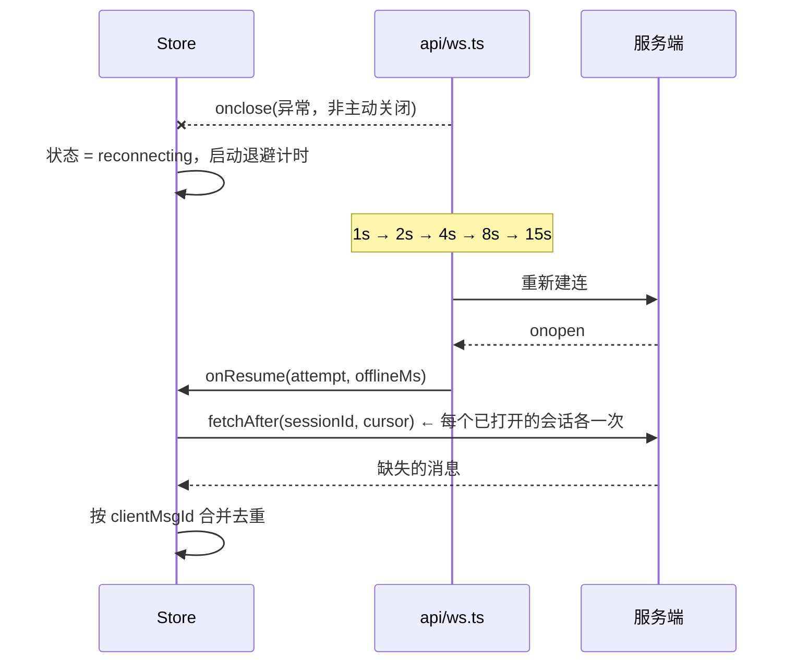

# M4 实时通信方案（WebSocket）

> 对应交付物：PDF 16.3 节 M4 的「实时通信处理方案」+「异常状态说明」。
> 状态：**待与 M6 评审后冻结**。第 5 节列出必须先对齐的字段。

## 1. 三层职责划分

```
页面（ChatDetailPage）
   │  只依赖最上层，不直接碰 WebSocket
   ▼
stores/realtime.ts      业务语义：消息缓存、乐观发送、补拉游标、ACK 超时
   │
   ├──► api/ws.ts       链路语义：建连、心跳、指数退避重连、事件去重、离线待发队列
   └──► api/chat.ts     持久化语义：历史拉取、增量补拉、HTTP 兜底发送
```

**为什么要分层**：`api/ws.ts` 里没有一行业务代码，所以它能被完整单测；`stores/realtime.ts` 里没有一行 WebSocket API，所以它能在 mock 数据源下跑通。

## 2. 三条不变量（M10 按这个验收）

| # | 不变量 | 保证机制 | 位置 |
|---|---|---|---|
| 1 | 同一 `clientMsgId` 的消息在界面上只出现一条 | 乐观消息、ACK、补拉结果统一按 `clientMsgId` 合并 | `stores/realtime.ts` `mergeMessages` |
| 2 | 同一 `eventId` 的事件只被处理一次 | 客户端去重表（FIFO，容量 500） | `api/ws.ts` `rememberEventId` |
| 3 | 断线期间的消息不丢 | 重连后按会话游标做增量补拉 | `stores/realtime.ts` `catchUp` |

> 注意：**不变量 3 由 HTTP 保证，不由 WebSocket 保证**。WS 只负责低延迟，断了就断了；正确性靠补拉兜底。这是整个方案最重要的一条设计决策。

## 3. 连接状态机



退避策略：`min(1000 × 2^n, 15000)` 再加 0~30% 抖动（避免大量客户端同时重连造成惊群）。

## 4. 关键时序

### 4.1 正常发送一条消息



**离线时**：`W.send()` 返回 `false`，消息进待发队列，**不启动 ACK 超时**（保持"发送中"），连接恢复后自动冲刷队列。

### 4.2 断线 → 重连 → 补拉



### 4.3 重复投递（实时推送 + 补拉重叠）

同一条消息可能被投递两次：一次实时推送，一次补拉。客户端处理链路是：
1. `api/ws.ts` 按 `eventId` 去重（拦掉完全重复的事件）；
2. `stores/realtime.ts` 按 `clientMsgId` 合并（拦掉"同一消息的不同事件"）；
3. 两者都拦不住时，`mergeMessages` 保证渲染层只有一条。

## 5. 与 M6 待确认清单（阻塞项）

| # | 问题 | 当前前端假设 | 影响 |
|---|---|---|---|
| 1 | 鉴权方式 | query string 传 token（浏览器 WebSocket 不能自定义 header） | 网关需允许；且 token 不能进访问日志 |
| 2 | 事件是否需要 `eventId` | **需要**，服务端生成 | 没有它就无法做幂等，重复投递会渲染成两条气泡 |
| 3 | `eventId` 生成规则 | 建议会话内单调递增，便于补拉定位 | 影响补拉能否用 eventId 做游标 |
| 4 | 心跳机制 | 应用层 `PING` / `PONG`，间隔 25s，连续 2 次未响应判死 | 若用协议层 ping 帧则前端这段逻辑要删掉 |
| 5 | 关闭码语义 | 4001 被踢 / 4002 心跳超时 / 4003 鉴权失败 | 前端靠它决定"是否自动重连" |
| 6 | 发送是否必须等 ACK | 是，超时才显示失败 | 若服务端不返回 ACK，失败态无法实现 |

## 6. 原型演示操作指南

页面 `/chat/5001` 右上角四个按钮：

| 按钮 | 动作 | 观察点 |
|---|---|---|
| 模拟断线 | `simulateDisconnect()` | 顶部出现重连横幅 → 1s 后自动重连 → 横幅消失 |
| 模拟对方发消息 | `injectEvent(MESSAGE_NEW)` | 新气泡出现（走完整去重链路） |
| 模拟掉线期间来消息 | 只写"服务端"不推送 | 界面上**看不到**，需点"模拟断线"触发重连后补拉才能看到 |
| 直接输入发送 | `sendText` | 先出现半透明的"发送中"气泡，ACK 后转为正常 |

演示"发送失败"：先点「模拟对方发消息」下方的链路按钮不可用，需在代码中把 `mockController.failNextAck()` 接上（原型模式下 `failNextSend()` 已暴露），3 秒后该条消息变为"发送失败，点击重试"。

## 7. 文件清单与上线替换方式

| 文件 | 性质 | 上线时 |
|---|---|---|
| `src/api/ws.ts` | 生产代码 | 保留 |
| `src/api/chat.ts` | 生产代码 | 保留，按 M6 实际路径微调 |
| `src/stores/realtime.ts` | 生产代码 | 保留 |
| `src/constants/websocket.ts` | 契约 | 保留，冻结前需 M6 签字 |
| `src/api/mockWsTransport.ts` | 原型专用 | **删除** |
| `src/mocks/chatBackend.ts` | 原型专用 | **删除** |

切换方式：配置 `VITE_WS_URL` 环境变量即可。未配置时 `IS_REALTIME_MOCK = true`，自动使用 mock 链路与内存消息源；配置后自动切到真实 WebSocket 与 HTTP 接口，**页面代码零改动**。
