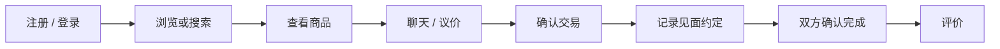
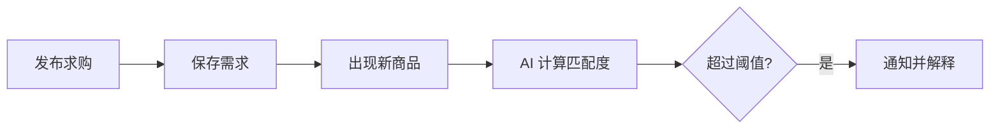
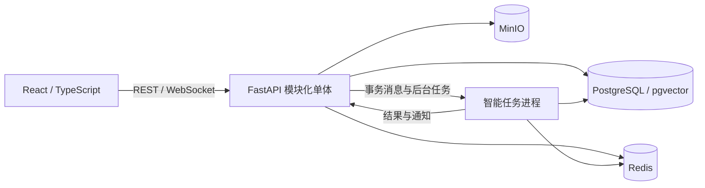
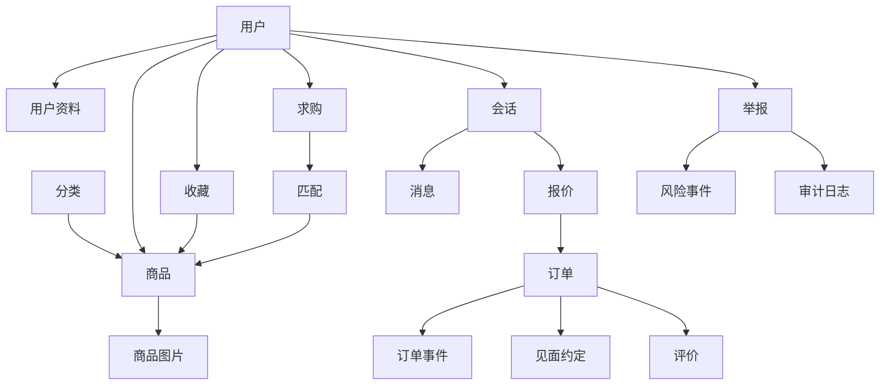

# CampusLoop AI 校园二手交易平台

## 项目需求与团队分工说明书

- 原始版本：1.2
- 原始日期：2026-09-15
- 团队：10 人
- 周期：10 周
- 原始阶段说明：项目需求、技术方案与团队分工；尚未进入开发阶段

> 本文件是 `CampusLoop_AI_Project_Overview_(3).pdf` 的 Markdown 整理版，保留 PDF 1.2 的范围和语义，便于版本控制、评审与链接。原始阶段说明是 2026-09-15 的历史记录；仓库当前状态以根目录 [README](../README.md) 和实际代码为准。

## 目录

1. [项目总览](#1-项目总览)
2. [项目背景](#2-项目背景)
3. [项目目标](#3-项目目标)
4. [用户与角色](#4-用户与角色)
5. [核心业务流程](#5-核心业务流程)
6. [功能模块](#6-功能模块)
7. [创新功能](#7-创新功能)
8. [功能优先级](#8-功能优先级)
9. [技术方案](#9-技术方案)
10. [系统架构](#10-系统架构)
11. [前端主要页面](#11-前端主要页面)
12. [后端主要模块](#12-后端主要模块)
13. [数据库概览](#13-数据库概览)
14. [安全设计](#14-安全设计)
15. [测试计划](#15-测试计划)
16. [十人团队分组与详细分工](#16-十人团队分组与详细分工)
17. [组内与跨组协作机制](#17-组内与跨组协作机制)
18. [五次汇报与十周任务安排](#18-五次汇报与十周任务安排)
19. [主要风险](#19-主要风险)
20. [项目交付物与验收要求](#20-项目交付物与验收要求)
21. [组员工作要点](#21-组员工作要点)

## 1. 项目总览

| 项目项 | 内容 |
|---|---|
| 项目名称 | CampusLoop AI：AI 增强型校园二手交易与智能匹配平台 |
| 一句话介绍 | 面向大学生的校园二手交易网页平台，通过智能搜索、求购匹配和价格建议，提高商品发现与交易协作效率 |
| 项目目标 | 建立商品发布、搜索、聊天、议价、订单、见面、完成和评价的完整闭环，并让 AI 功能直接参与实际流程 |
| 目标用户 | 校园学生；负责内容和用户治理的管理员 |
| 核心功能 | 用户、商品、搜索、收藏、求购、聊天、议价、订单、预约、评价、举报、通知和管理后台 |
| 核心创新 | AI 语义搜索、求购供需匹配、AI 价格建议、信誉与风险辅助分析 |
| 主要技术 | React + TypeScript + FastAPI + PostgreSQL/pgvector + Redis + WebSocket + Docker |
| 团队与周期 | 10 人，10 周，设置 5 次课程汇报节点 |

产品定位为“校园场景 + AI 智能匹配 + 可信交易”。基础体验接近通用二手平台，但校园公共地点、学生作息、求购等待和面对面交易是核心设计条件。

本项目完全由软件构成，不使用 Arduino、RFID、摄像头、智能柜或其他硬件，也不接入真实支付、物流、学校 SSO 和身份证认证。

## 2. 项目背景

校园二手信息通常分散在微信群、QQ 群、校园墙、朋友圈和通用交易平台中。不同渠道的发布格式和更新方式不统一，学生容易遇到重复信息、过期商品和检索成本高的问题。

传统关键词搜索难以理解“预算 1000 左右、适合宿舍写代码的显示器”这类用途型表达；卖家也缺少成色、使用时间和历史价格的参照。买方今天发布需求时可能没有对应商品，几天后商品出现又得不到提醒。面对面交易还需要双方反复协调时间和地点。

校园内部距离较近，但并不天然可信。描述不准确、异常低价、频繁取消、骚扰和恶意举报仍需要记录、评价和人工处理。CampusLoop AI 因此将统一市场、持久求购、实时沟通、交易状态和解释性 AI 组合在一个可测试的流程中。平台只提供辅助信息，不担保付款、商品质量或真实学籍。

## 3. 项目目标

1. 建立完整校园二手市场。学生可以维护账号资料、发布多图商品、浏览、筛选、收藏和管理商品状态。
2. 打通交易闭环。从搜索、聊天、议价到订单、见面约定、双方确认和评价均在同一平台内完成记录。
3. 提高检索效率。在关键词搜索基础上加入语义检索，使用途描述也能找到名称不同但含义相关的商品。
4. 连接延迟出现的供需。保存求购需求；新商品出现时自动计算匹配度并向买方说明匹配原因。
5. 提供价格参考。根据类别、品牌、原价、使用时间、成色、历史价格和需求提供估价区间，同时说明数据不足或影响因素。
6. 保留必要的见面记录。买卖双方通过私聊自行协商时间和地点，平台只记录双方最终确认的约定，不开发智能推荐功能。
7. 建立基础可信机制。只允许完成订单的参与者评价；信誉和风险结果可以解释，管理员作出最终治理决定。

## 4. 用户与角色

| 角色 | 主要能力 |
|---|---|
| 学生用户 | 注册登录、管理资料、浏览搜索、收藏、发布商品和求购、聊天、议价、管理订单、预约、完成确认、评价和举报。一个账号可在不同交易中同时作为买方和卖方 |
| 买方 | 在具体交易中搜索或接收匹配、联系卖家、提出报价、确认见面与完成、评价卖家。不能购买自己的商品 |
| 卖方 | 发布和管理本人商品、查看咨询和报价、接受/拒绝/还价、确认见面与完成、评价买家 |
| 管理员 | 管理用户和商品、处理举报和纠纷、查看风险提示与平台统计。管理员权限必须由后端验证，并记录操作原因 |

校园邮箱认证采用教学模拟标识，不代表学校真实认证。公开资料只展示昵称、头像、聚合评分、交易次数和信誉说明；邮箱、聊天、见面约定和举报证据不公开。

## 5. 核心业务流程

### 5.1 普通交易

### 5.2 卖家流程

### 5.3 求购匹配

交易确认采用软件内双方独立确认。只有双方针对同一预约版本确认后，订单才进入“已完成”，商品进入“已售”；单方确认不会自动完成，也不证明平台核实了付款。订单主要状态为待确认、已预约、见面已安排、已完成、已取消和有争议。

## 6. 功能模块

| 模块 | 主要功能 | 重要程度 |
|---|---|---|
| 用户系统 | 注册、登录、退出、资料、头像、学校/学院/专业、交易次数、评分和信誉等级 | 最小可行版本 |
| 商品系统 | 发布、编辑、逻辑删除、下架、多图、分类、成色、原价、售价、描述、地点；可售/已预约/已售/隐藏状态 | 最小可行版本 |
| 首页与市场 | 最新、热门、分类、基础推荐、分页和排序 | 最小可行版本 |
| 搜索 | 关键词；按价格、分类、成色、地点、时间筛选；AI 语义搜索 | 关键词为最小可行版本；语义为核心层 |
| 收藏 | 收藏、取消和收藏列表；标识已售或下架商品 | 最小可行版本 |
| 求购市场 | 发布目标商品、预算、最低成色、地点和有效期；编辑、关闭与浏览 | 核心层 |
| 聊天 | 双人实时消息、商品卡片、报价卡片、聊天历史和断线补拉 | 最小可行版本 |
| 议价 | 出价、接受、拒绝和还价及报价历史 | 最小可行版本 |
| 订单 | 待确认、已预约、见面已安排、已完成、已取消和有争议及状态事件 | 最小可行版本 |
| 见面约定 | 买卖双方在私聊后记录确认的时间和地点，支持修改与双方确认 | 最小可行版本 |
| 评价 | 完成后总体、描述准确、沟通、守时和评论；非参与者不能评价 | 最小可行版本 |
| 举报 | 虚假商品、描述不符、垃圾信息、异常价格、骚扰和违规商品 | 最小可行版本 |
| 通知 | 新消息、报价、接受、匹配、订单变化、见面提醒和处理结果 | 最小可行版本 |
| 管理后台 | 用户/商品/举报管理、人工风险查看、审计和基础统计 | 基础为最小可行版本；高级统计为扩展层 |

## 7. 创新功能

| 功能 | 解决的问题 | 实现方案 | 本期安排 |
|---|---|---|---|
| 智能语义搜索 | 用途描述与商品标题不一致 | 句向量生成文本向量，配合关键词和分类、价格等条件完成混合搜索 | 重点完成 |
| 求购市场与智能供需匹配 | 需求和商品出现时间错位 | 保存求购，按语义、价格、分类、成色和地点生成匹配结果及原因 | 重点完成 |
| 智能价格建议 | 买卖双方缺少价格参照 | 先提供分类与成色规则区间；数据足够时再启用回归模型并解释影响因素 | 尽量完成 |
| 信誉与风险辅助功能 | 缺少持续行为与治理依据 | 先按完成数、评分和已核实举报形成规则提示；风险结果只供管理员参考 | 可选扩展 |

语义检索不是简单的关键词模糊查询；匹配分“92/100”只是综合匹配程度，不是 92% 的成交概率。价格建议是参考区间，卖家保留定价权。信誉分和风险提示都必须展示主要依据，AI 不得自动封禁用户。

## 8. 功能优先级

**最小可行版本必须完成**：注册登录、资料、商品发布/浏览/详情、关键词搜索和筛选、收藏、聊天、议价、订单、见面约定记录、双方完成确认、评价、举报/通知和基础管理后台。没有这些，平台无法形成可演示的交易闭环。

**核心创新应尽量完成**：智能语义搜索、求购市场、AI 供需匹配、AI 价格建议和规则化信誉分。AI 模型未达到数据条件时必须保留关键词、规则价格或规则匹配作为可用基线。

**可选扩展目标**：风险智能功能、智能商品描述助手、高级推荐、邮件通知和高级数据分析。第 8 周冻结范围；如果最小可行版本或核心层不稳定，扩展层不进入本次提交。

## 9. 技术方案

| 技术 | 用途 | 选择原因 |
|---|---|---|
| React + TypeScript + Vite | 前端组件、类型、页面开发与构建 | 适合多人按页面协作，类型可减少接口字段错配 |
| Ant Design + ECharts | 表单、表格、管理后台和统计图 | 减少重复界面开发，支持一致后台界面 |
| Python + FastAPI | REST 接口、WebSocket 入口、校验和权限 | 团队熟悉 Python，便于形成清晰接口契约 |
| PostgreSQL + pgvector | 交易数据、关系约束与向量检索 | 订单需要强关系和事务；向量可与商品筛选处于同一数据库体系 |
| Redis | 缓存、限流、实时提示和后台任务队列 | 多进程共享短期状态，但订单事实仍以数据库为准 |
| WebSocket | 双向实时聊天 | 支持即时发送；断线时通过 HTTP 历史补拉 |
| sentence-transformers | 商品、查询与求购文本向量化 | 使用预训练模型，避免从零训练语言模型 |
| LightGBM + SHAP | 结构化价格预测与解释 | 适合表格特征；只有样本足够且优于规则基线时启用 |
| scikit-learn | 评估、基线和可选风险实验 | 便于构建可复现实验与孤立森林算法扩展 |
| pytest + Playwright | 后端、接口、集成和浏览器端到端测试 | 可覆盖状态机、权限和双账号完整流程 |
| Docker + Compose | 未来统一运行环境 | 比手动配置稳定，复杂度低于 Kubernetes |
| GitHub + Actions | 任务单、合并请求、评审和持续集成 | 贡献与变更可追踪，方便十人协作 |

## 10. 系统架构

系统采用模块化单体架构加智能任务进程。React 负责页面，FastAPI 按账号、商品、订单等领域模块组织业务，PostgreSQL 保存交易事实，Redis 支持缓存和消息提示，MinIO 保存图片，智能任务进程异步完成索引和匹配。

模块化单体比“所有代码放一起”更清晰，各模块仍可独立分工；又比全微服务少了网络调用、独立部署和分布式事务，适合由 10 名大二学生组成的团队。订单、商品占用和事件可在一个数据库事务中完成。智能任务进程失败时，发布、关键词搜索和交易仍应可用，并明确提示智能功能暂不可用。

## 11. 前端主要页面

| 页面 | 主要作用 | 负责人类型 |
|---|---|---|
| 首页、搜索、商品详情、发布商品、我的商品、收藏 | 商品发现和卖家管理 | M3（市场与求购前端） |
| 登录/注册、个人中心 | 会话与资料 | M2（前端基础）与 M5（账号后端） |
| 求购市场、发布求购、AI 匹配结果 | 表达需求并查看解释 | M3、M7 与 M8 |
| 聊天、订单、见面约定、通知 | 协商、状态和见面流程 | M4（交易流程前端） |
| 管理后台、举报管理、用户管理 | 人工治理和数据概览 | 前端基础负责人和项目负责人 |

页面保持现代、简洁、专业和校园感，不做淘宝界面复刻。桌面展示多列商品和双栏聊天，平板采用折叠侧栏，手机采用单列和底部导航。AI 结果必须显示理由与降级状态，不把匹配分写成成交概率。

## 12. 后端主要模块

| 模块 | 负责内容 |
|---|---|
| 账号与认证 | 注册登录、令牌、模拟认证、角色权限 |
| 用户资料 | 资料、公开评分和信誉读取 |
| 商品管理 | 商品、图片、状态、收藏 |
| 搜索 | 关键词筛选与混合搜索 |
| 求购管理 | 求购生命周期 |
| 供需匹配 | 匹配评分、原因、反馈与通知触发 |
| 聊天 | 会话、历史、实时票据和消息去重 |
| 议价 | 报价、拒绝、接受与还价链 |
| 订单 | 订单状态、商品锁定、完成和纠纷 |
| 见面约定 | 时间、地点、修改与双方确认 |
| 评价 | 完成后评价和评分聚合 |
| 举报 | 举报、证据和申诉 |
| 通知 | 站内通知、已读和提醒 |
| 管理后台 | 人工用户/商品/举报操作入口 |
| 数据分析 | 只读平台统计 |
| 智能功能 | 语义、价格、信誉与风险适配器 |

后端按动作提供接口，例如接受报价、确认见面约定和确认完成，不允许前端任意修改订单状态。管理入口调用同一业务规则，不能绕过商品、订单或举报模块。

## 13. 数据库概览

核心实体包括用户、用户资料、商品分类、商品、商品图片、收藏、求购、匹配、会话、消息、报价、订单、订单事件、见面约定、评价、举报、通知、风险事件和审计日志。

一个用户可发布多个商品和求购；收藏和匹配分别连接用户-商品、求购-商品。一个商品可收到多个报价，但同时最多只能有一个有效预约订单。每个订单保留状态事件；只有已完成订单允许双方各写一条评价。举报、风险和管理员操作必须保留审核记录。

## 14. 安全设计

- 密码只保存安全 Hash，不记录明文；访问令牌短期有效，刷新令牌可轮换和撤销。
- RBAC 和资源所有权由后端验证。隐藏前端按钮只是界面体验，不能代替权限检查。
- FastAPI/Pydantic 校验输入；数据库参数化查询防止 SQL 注入；消息和评论按纯文本转义，避免 XSS。
- 上传只允许实际可解码的 JPEG/PNG/WebP，限制数量、大小和尺寸，随机生成对象键并剥离元数据。
- 登录、恢复、聊天和举报接口限流。邮箱、聊天、时段和证据不进入普通日志。
- 管理员限制账号、隐藏商品或处理举报时必须填写原因并写入审计日志。风险智能功能只能提供理由和排序，最终决定由管理员完成。

## 15. 测试计划

| 测试类型 | 未来测试重点 |
|---|---|
| 单元测试 | 状态机、时间区间、价格/匹配规则、权限判断和异常分支 |
| 接口测试 | 注册登录、输入错误、跨用户访问、商品/求购/Offer/订单/评价接口 |
| 集成测试 | PostgreSQL 事务与锁、Redis、MinIO、Worker、通知、聊天重连 |
| 端到端测试 | 两个学生账号和一个管理员账号完成真实浏览器流程 |
| 性能测试 | 100 个模拟并发用户、搜索响应、聊天推送和匹配队列延迟 |

重点端到端测试为：注册 -> 登录 -> 发布商品 -> 搜索 -> 聊天 -> 报价 -> 接受 -> 记录见面约定 -> 双方完成 -> 评价；同时测试第二买方并发接受失败、修改约定后旧确认失效、非参与者评价被拒绝和管理员处理举报。

语义搜索未来使用前 K 项准确率、前 K 项召回率和平均倒数排名；价格预测使用平均绝对误差和有效价格上的平均绝对百分比误差；匹配使用前 5 项准确率和曝光后的接受率。只有真实标注集或实际测试完成后才能填写结果，当前不生成任何准确率或性能结论。

## 16. 十人团队分组与详细分工

团队采用“四个主责组、十人唯一归属、跨组共同验收”的组织方式。每位成员只归属一个主责组，便于追踪任务进度和交付；涉及接口、数据、测试和演示时再按任务组成临时联调小组。成员编号 M1 至 M10 可在确定真实姓名后统一替换。

### 16.1 分组总览

| 组别 | 成员 | 组内负责人 | 负责范围 | 小组必须交付 |
|---|---|---|---|---|
| 项目管理与质量组 | M1、M10 | M1 负责进度与集成；M10 负责质量 | 需求、计划、变更、集成、测试、文档和最终提交 | 需求基线、五次汇报材料、周计划、测试报告、用户手册、集成版本和演示材料 |
| 前端体验组 | M2、M3、M4 | M2 | 设计规范、公共组件、市场页面和交易页面 | 可运行前端、组件库、页面说明、前后端联调记录和双账号演示流程 |
| 后端与平台组 | M5、M6、M9 | M6 负责业务；M9 负责平台 | 账号权限、商品交易、数据库、缓存、文件、部署和持续集成 | 接口服务、数据库迁移、一键运行环境、备份恢复方案和接口文档 |
| 智能功能组 | M7、M8 | M7 | 语义搜索、供需匹配、价格建议、信誉与风险辅助 | 数据处理脚本、模型或规则服务、评估报告、模型说明和降级方案 |

### 16.2 项目管理与质量组：M1、M10

小组定位：把需求变成可验收任务，持续检查所有小组是否按统一接口、统一环境和统一质量标准交付。该组不代替其他成员测试，而是制定门槛、独立复测并负责最终整合。

**M1：项目负责人、需求与集成负责人**

- 必须完成：维护需求编号、功能优先级、十周计划、任务看板和变更记录；主持每周计划会与演示会；确认接口、状态机和数据口径；维护集成分支；实现最小管理后台接口、通知聚合或集成验收工具，确保本人也有可运行代码交付。
- 个人交付物：需求规格与追踪表、工作分解和周计划、会议纪要、变更日志、风险登记表、集成检查清单、最终整合版本和项目总结。
- 验收证据：每个功能都有负责人和验收条件；每周有可演示增量；完整交易流程可在统一环境中运行。
- 主要协作：与 M2、M6、M7、M9 确认设计边界，与 M10 确认测试结果，并统筹五次汇报内容。

**M10：测试、文档与发布质量负责人**

- 必须完成：在开发前编写测试场景；建设单元、接口、端到端和性能测试入口；准备测试账号与测试数据；管理缺陷等级、复测和关闭；从干净环境执行部署与恢复演练；统筹用户手册、演示脚本和答辩材料。
- 个人交付物：测试计划、自动化测试脚本、持续集成质量门禁、缺陷清单、性能与恢复报告、用户手册、验收报告和演示检查表。
- 验收证据：核心流程自动化通过；严重缺陷清零；非作者能按说明启动系统并完成演示。
- 主要协作：各模块作者提供自测，M10 独立复测，M1 决定是否进入发布候选。

### 16.3 前端体验组：M2、M3、M4

小组定位：负责所有用户可见页面和交互，统一组件、状态提示和接口调用方式，确保学生端和管理端形成连续可演示流程。

**M2：前端组负责人、界面与交互基础**

负责设计规范、颜色与字号、路由、登录态、权限路由、接口请求封装、表单校验、加载/空白/错误状态、响应式布局和通用组件；同时完成账号资料页及后台通用表格。交付前端工程骨架、组件库、设计规范、接口封装、账号资料页和组件使用说明；与 M3、M4 约定公共组件，与 M5 对接登录和权限。

**M3：市场与求购前端负责人**

负责首页、分类、商品列表、筛选搜索、商品详情、发布编辑、图片上传、收藏、卖家中心、求购发布、匹配结果和价格解释界面；处理分页、筛选条件保留、表单草稿和接口错误。交付市场与求购页面、对应接口联调记录、页面测试和演示数据；与 M6 对接商品和求购接口，与 M7、M8 对接匹配与价格结果。

**M4：交易流程前端负责人**

负责聊天、议价、订单时间线、通知、见面约定记录、双方完成确认、评价、举报和个人交易中心；处理实时连接断开、消息补拉、重复提交、按钮权限和约定修改提示。交付交易页面、实时通信处理、双账号端到端演示脚本和异常状态说明；与 M6 共同维护交易状态，与 M10 完成并发和断线测试。

前端组共同完成标准：页面不能只展示静态数据；主流程必须接入真实接口；每个页面至少覆盖加载、空数据、成功、失败和无权限状态；公共组件修改由 M2 评审，业务页面由另一名前端成员交叉评审。

### 16.4 后端与平台组：M5、M6、M9

小组定位：负责平台业务规则、数据一致性和可重复运行环境，是前端和智能功能的共同基础。

**M5：账号、用户与权限后端负责人**

负责注册登录、令牌刷新与退出、用户资料、评价与信誉读取、通知、角色权限、限流、跨站请求保护和隐私字段控制；编写越权访问与异常输入测试。交付账号与用户接口、权限矩阵、接口文档、单元和接口测试、安全检查记录；与 M2 对接登录体验，与 M9 对接会话和数据库。

**M6：市场与交易后端负责人**

负责商品、求购、议价、订单、聊天、见面约定记录、评价约束和举报业务；实现状态机、事务、并发控制、幂等请求和不可变事件记录；对外维护交易接口契约。交付市场与交易接口、订单状态机、业务规则说明、并发测试和异常回滚证据；与 M3、M4 联调页面，与 M7 联调供需匹配。

**M9：数据库、运行环境与持续集成负责人**

负责数据库表结构、迁移、索引、向量扩展、缓存、对象存储、后台任务、容器编排、环境变量模板、持续集成、日志、备份和恢复；任何结构变更必须提供迁移与回滚说明。交付数据库模型、迁移脚本、一键启动环境、持续集成流水线、部署说明、备份恢复脚本和运行监控清单；与 M5、M6 确认事务和索引，与 M7、M8 提供数据与任务环境。

后端与平台组共同完成标准：接口契约先于页面联调；数据库变更只能通过迁移脚本；订单事实以数据库为准；缓存和智能任务失败时基础交易仍可运行；每个写接口必须覆盖权限、幂等和失败回滚。

### 16.5 智能功能组：M7、M8

小组定位：在不影响基础交易可用性的前提下实现可解释、可评估、可降级的智能功能。所有效果指标必须来自真实测试数据。

**M7：语义搜索与供需匹配负责人**

负责数据标注方案、文本清洗、向量生成、向量索引、关键词与语义混合检索、求购与商品匹配、去重通知、任务版本和离线评估；提供关键词基线与超时降级。交付索引脚本、搜索与匹配服务、标注样本、评估程序、指标报告、接口说明和降级方案；与 M3 确认展示字段，与 M6 确认事件触发，与 M9 确认向量环境。

**M8：价格建议、信誉与风险辅助负责人**

负责价格数据清洗、分类与成色规则基线、可选回归模型、价格区间与影响因素解释、信誉平滑规则、人工风险线索和申诉重算；明确模型不能自动定价或封禁。交付价格规则和模型、评估脚本、模型说明、数据质量报告、信誉与风险规则、解释字段和人工兜底方案；与 M5 确认信誉口径，与 M6 确认交易特征，与 M10 确认评估方法。

智能功能组共同完成标准：保存数据版本、参数和运行时间；至少与简单规则或关键词方案比较；结果包含依据和置信提示；服务不可用时返回明确降级状态，不阻塞发布、浏览和交易。

### 16.6 替补关系与进度处理

主要替补关系为：M1 与 M10 互为项目资料替补；M2 可接管 M3 或 M4 的公共前端问题；M5 与 M6 互审后端接口；M9 可协助 M5 处理数据库与部署故障；M7 与 M8 互审数据和评估脚本。

成员连续两次未完成周目标时，由组内负责人先结对拆小任务；仍无法恢复时，M1 调整范围或重新分配，不等到最后一周处理。

## 17. 组内与跨组协作机制

### 17.1 从需求到交付的统一流程

1. M1 把需求写成任务，注明需求编号、业务规则、负责人、协作者、依赖、验收条件和截止周次。
2. 主责成员先与上下游确认接口、字段、状态和异常处理，再开始编码；接口变化必须同步更新文档和测试。
3. 作者在个人分支完成代码、自测和必要说明，提交小型合并请求，不把多个无关模块堆在一次提交中。
4. 由同组一名成员检查实现质量，再由受影响的下游成员检查接口兼容；数据库、安全和交易状态修改必须增加专项评审。
5. M10 在统一环境执行自动化与端到端复测，缺陷退回原作者修复；M9 确认部署、迁移和配置可重复。
6. M1 按验收条件进行业务验收，只有代码、测试、文档和演示证据齐全才标记完成。

### 17.2 固定协作节奏

| 时间 | 参加人员 | 必须形成的结果 |
|---|---|---|
| 每周一计划会 | 全员，M1 主持 | 确认本周目标、每人任务、依赖和验收方式，更新任务看板 |
| 每天 10 分钟同步 | 各组内部 | 只说明已完成、当天计划和阻塞；阻塞超过半天立即报告 |
| 每周三接口会 | M2、M6、M7、M9 及相关成员 | 冻结本周接口、数据结构和错误码，记录变更影响 |
| 每周五演示与评审 | 全员，M10 记录问题 | 在统一环境演示可运行增量，现场记录缺陷、遗留和下周调整 |
| 里程碑验收 | M1、M10 和相关组负责人 | 第 5 周验收基础交易闭环，第 8 周功能冻结，第 10 周验收提交包 |

### 17.3 跨组接口与责任边界

- **前端与后端**：以后端接口说明为字段基线，以前端真实页面为联调场景。新增字段先更新接口样例和错误码；前端不得自行猜测订单状态，后端不得只返回无法解释的通用错误。
- **后端与智能功能**：通过版本化任务和结果结构连接。后端负责权限、业务事件和结果落库，智能功能组负责算法、解释、指标和降级状态；超时不阻塞基础交易。
- **后端与平台**：M5、M6 提出数据约束，M9 审查表结构、索引、迁移和回滚。任何人不得直接手改共享数据库替代迁移脚本。
- **测试与所有小组**：模块作者先提交自测证据，M10 负责独立复测和跨模块场景。测试失败由原作者修复，M10 不承担代写业务代码的责任。
- **文档与演示**：每名成员编写自己模块的说明和演示要点，M1 统一结构，M10 验证步骤。最终答辩每个小组至少有一人能解释设计、实现、测试和限制。

### 17.4 完成标准与冲突处理

一项任务只有同时满足以下条件才算完成：代码已合并；自动化检查通过；关键异常路径已验证；接口或数据变更已有说明；能在统一环境复现；相关页面或接口可演示；不存在未说明的严重缺陷。仅完成页面截图、只写文档、只训练模型或只在个人电脑运行，都不能算完整交付。

代码冲突由模块负责人协调，需求冲突由 M1 裁决，质量门槛由 M10 说明，数据库与环境冲突由 M9 给出迁移方案。影响他人的变更必须在当天通知；阻塞超过一个工作日仍未解决时，由 M1 召集相关成员确定修改接口、结对处理或缩减范围。

## 18. 五次汇报与十周任务安排

课程具体汇报日期如有调整，以教师通知为准。本计划按十周、每两周一次汇报组织。每次汇报必须展示已经形成的材料或可运行结果，不能只说明之后准备做什么。

### 18.1 五次汇报分别提交什么

| 汇报节点 | 建议周次 | 本次必须提交 | 汇报主责 | 现场检查重点 |
|---|---:|---|---|---|
| 第一次汇报 | 2 | 选题说明、问题背景、目标用户、功能范围、四组名单、需求候选清单和十周计划 | M1、M10 统筹；各组说明本组任务 | 问题是否明确；功能是否能在十周内完成；每项任务是否有人负责 |
| 第二次汇报 | 4 | 需求基线、页面原型、系统架构图、数据库初稿、接口清单、核心状态规则、测试场景和运行环境 | M2 展示原型；M6 讲业务；M9 讲数据与环境；M10 讲测试 | 原型能否走通；接口和数据是否一致；项目能否在统一环境启动 |
| 第三次汇报 | 6 | 可运行的基础交易闭环、测试账号、演示数据、接口文档、阶段测试记录和代码版本标签 | 前端体验组与后端平台组主讲；M10 复核 | 用两个账号完成发布、搜索、聊天、议价、下单、见面约定、双方确认和评价 |
| 第四次汇报 | 8 | 语义搜索、供需匹配和价格建议候选版，基线对比结果、系统集成版、遗留问题清单和冻结范围 | M7、M8 讲智能功能；M1 讲集成与范围 | 至少展示两个智能功能；结果有解释；智能服务不可用时基础交易仍可运行 |
| 第五次汇报 | 10 | 最终系统、源代码、需求与设计文档、测试报告、部署和用户手册、汇报幻灯片、演示视频及成员贡献说明 | M1、M10 统筹；每组说明交付和贡献 | 新电脑可按说明启动；十分钟内完成主流程演示；提交包无缺项 |

### 18.2 每周各组具体任务

| 周次 | 本周目标 | 各组具体工作 | 必须形成的证据 |
|---|---|---|---|
| 第 1 周 | 确定范围和分工 | 管理质量组整理需求与任务表；前端组画主要页面草图；后端平台组列业务实体和运行方案；智能功能组检查数据来源与可行基线 | 需求清单、四组名单、任务负责人、项目仓库和第一次会议纪要 |
| 第 2 周 | 完成第一次汇报 | 管理质量组整合选题与计划；前三个开发组确认页面、接口和智能功能边界；全员评审并删减超出周期的功能 | 第一次汇报幻灯片、汇报记录、需求候选版和十周任务表 |
| 第 3 周 | 完成详细设计 | 前端组完成可点击原型和组件规范；后端平台组完成架构、数据库和接口初稿；智能功能组确定标注样本、规则基线和评价方法；M10 编写核心测试场景 | 原型链接或文件、架构图、数据表、接口清单、测试用例和样本说明 |
| 第 4 周 | 完成第二次汇报 | 各组按评审意见修订设计；M9 搭建统一运行环境；M1 锁定需求基线；M10 检查文档版本和设计对应关系 | 第二次汇报材料、需求基线、设计基线、可启动环境和评审问题清单 |
| 第 5 周 | 开发基础功能 | 前端组完成登录、商品发布、列表、详情和聊天页面；后端平台组完成账号、商品、搜索、聊天和图片接口；智能功能组完成关键词与规则基线；质量组建立自动检查 | 可运行账号与商品流程、接口文档、测试账号、演示数据和自动检查结果 |
| 第 6 周 | 完成第三次汇报 | 前后端完成议价、订单、见面约定、双方完成和评价联调；M9 固定数据库迁移；M10 执行双账号端到端测试；智能功能组提供可接入接口样例 | 基础交易闭环、第三次汇报材料、阶段测试记录、缺陷清单和代码版本标签 |
| 第 7 周 | 接入智能功能 | M7 接入语义搜索和供需匹配；M8 接入价格区间建议；前端组完成解释页面；后端平台组完成任务触发、结果保存和超时降级；质量组准备对比测试 | 智能功能候选版、基线对比数据、接口联调记录和降级演示 |
| 第 8 周 | 完成第四次汇报并冻结功能 | 各组完成系统集成；前端组补齐管理与错误状态；后端平台组补齐权限和日志；智能组完成指标与限制说明；M1 冻结新增需求 | 第四次汇报材料、集成版本、测试结果、遗留问题和冻结范围清单 |
| 第 9 周 | 集中测试和修复 | M10 组织功能、接口、并发、性能和恢复测试；作者修复本人模块；M9 做干净环境部署；M1 检查最终提交清单；各组同步完成技术文档 | 发布候选版、缺陷关闭记录、测试报告、部署记录、用户手册初稿和演示脚本 |
| 第 10 周 | 完成第五次汇报与提交 | M1 整合最终版本和贡献记录；M10 复验并整理答辩材料；M9 打包部署文件；各组提供最终文档、演示片段和答辩说明 | 最终系统、第五次汇报材料、演示视频、完整提交包和成员贡献说明 |

第五周结束时必须能运行账号与商品主流程，第六周结束时必须形成基础交易闭环，第八周停止新增功能。任何一周未完成的任务都要在周五写明负责人、原因和新的截止时间，不能只口头顺延。

## 19. 主要风险

| 风险 | 影响 | 应对方式 |
|---|---|---|
| AI 训练数据不足 | 价格和风险模型无法可靠训练 | 第 1 周确认许可与样本；价格采用规则基线，风险智能功能延期 |
| AI 效果不理想 | 创新演示缺乏说服力 | 与关键词/规则比较，报告失败类别，不伪造数值 |
| 前后端接口不一致 | 页面与交易联调延误 | 第 3 周统一契约、枚举和错误码，变化同步通知与测试 |
| 十人 Git 冲突 | 重复修改和合并困难 | 小型合并请求、模块目录、指定评审人和每日同步阻塞 |
| 成员进度落后 | 关键模块成为单点 | 每周检查完成证据；连续落后则结对和重分任务 |
| 功能过多 | 最小可行版本无法按时完成 | 严格最小可行版本/核心层/扩展层，第 8 周冻结 |
| WebSocket 集成问题 | 消息丢失或权限漏洞 | 先持久化再推送、HTTP 补拉；必要时保留轮询提示 |
| 部署环境问题 | 最终演示失败 | 第 4 周建立统一环境，第 9 周由非作者做干净部署与恢复演练 |
| AI 生成代码质量不一致 | 隐蔽逻辑错误和维护困难 | 提交者解释、人工评审、状态/安全真实测试，不通过即重写 |

## 20. 项目交付物与验收要求

下表列出计划在后续开发阶段形成的提交物。每项交付都必须有主责小组、可复现内容和验收证据，不能只提交截图或口头说明。

| 类别 | 具体交付内容 | 主责小组 | 验收要求 |
|---|---|---|---|
| 项目管理材料 | 需求规格、范围、工作分解、十周计划、会议纪要、风险登记和变更记录 | 项目管理与质量组 | 需求可追踪到负责人、代码、测试和演示；范围变化有记录 |
| 前端系统 | 学生端、管理端、公共组件、页面状态和接口封装 | 前端体验组 | 可连接真实后端；核心页面覆盖加载、空数据、错误和无权限状态 |
| 后端系统 | 账号、商品、求购、聊天、议价、订单、见面约定、评价、举报、通知与管理接口 | 后端与平台组 | 接口文档完整；权限、事务、幂等和错误分支通过测试 |
| 数据与运行环境 | 数据库模型、迁移、索引、缓存、文件存储、容器和持续集成 | 后端与平台组 | 新电脑按说明可启动；迁移可重复；备份可恢复 |
| 智能功能 | 语义搜索、供需匹配、价格建议、信誉和风险辅助规则或模型 | 智能功能组 | 有基线、数据版本、评估程序、解释字段和不可用时的降级方案 |
| 自动化测试 | 单元、接口、端到端、并发、性能和恢复测试 | 项目管理与质量组牵头，全员参与 | 核心交易流程自动化通过；严重缺陷关闭；结果来自真实运行 |
| 技术文档 | 架构、接口、数据库、智能功能、测试、部署和安全说明 | 各组编写，M1 整合 | 内容与最终代码一致，明确已完成、部分完成和未完成项 |
| 用户与部署文档 | 用户手册、管理员操作、部署步骤、配置模板和故障恢复 | M9、M10 | 非作者可独立安装、启动、完成交易并执行基本恢复 |
| 演示与答辩材料 | 汇报幻灯片、演示脚本、测试账号、演示数据和演示视频 | M1、M10 统筹，全员参与 | 十分钟内展示主流程和至少两个智能功能；准备无网络备用方案 |
| 课程提交包 | 源代码、版本标签、文档、测试证据、运行说明和贡献记录 | 项目管理与质量组 | 文件结构清楚、能复现、无密钥和个人敏感信息、成员贡献可说明 |

上述内容均为计划交付物，本说明书不表示它们已经实现。最终提交时，每项必须标记为“已完成、部分完成或未完成”，并附代码位置、测试结果或演示步骤。智能效果、性能和覆盖率只能引用实际运行数据。

## 21. 组员工作要点

1. 四个主责组为：M1 和 M10 组成项目管理与质量组；M2 至 M4 组成前端体验组；M5、M6 和 M9 组成后端与平台组；M7 和 M8 组成智能功能组。
2. 每人只归属一个主责组，但接口、数据、测试和最终演示必须跨组完成。
3. 第六周前完成发布、搜索、聊天、议价、订单、见面约定、双方确认和评价的基础交易闭环。
4. 智能功能直接参与搜索、求购匹配和价格参考，并必须提供基线、评估、解释和降级。
5. 任务必须写明负责人、协作者、依赖、验收条件和截止周次，完成代码不等于完成交付。
6. 模块作者先自测，另一名成员评审，M10 独立复测，M1 按业务目标验收。
7. 数据库结构通过迁移脚本修改，接口变化同步更新页面、文档和测试。
8. 阻塞超过半天立即报告，影响其他组的变更当天通知，不能拖到周末联调时再说明。
9. 五次汇报分别检查范围、设计、基础闭环、智能功能和最终提交；第八周冻结新功能，第九周集中测试与修复，第十周只做整合、文档、演示和提交。
10. 先保证系统完整、可部署、可测试，再增加高级算法；不伪造智能效果或测试结果。
